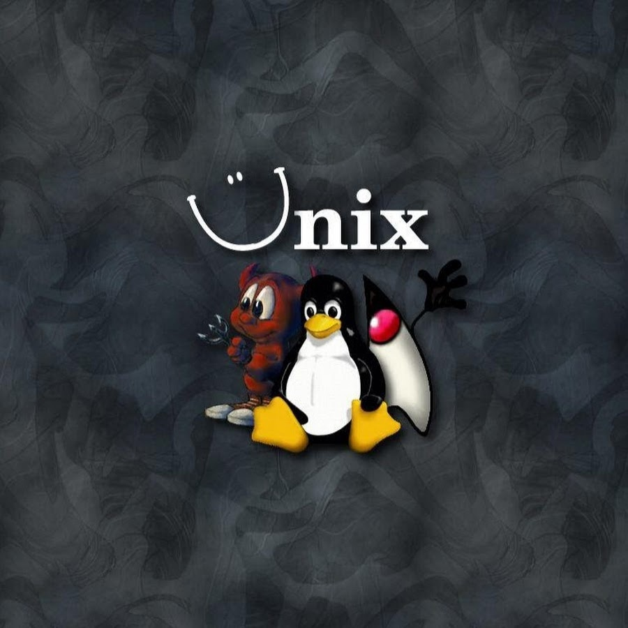

# UNIXTime

[[**Статьи**](articles/README.md)] | [[**Правила**](rules.md)] | [[**Поддержать меня**](donate.md)] | [[**Telegram**](https://t.me/unixtime_channel)]

Доброго времени суток! На этом сайте расположены особо крупные статьи канала [UnixSovet](https://t.me/UnixSovet), не вписывающиеся в формат коротких постов Telegram.

**Основная тематика сайта/канала:**

- новости
- всевозможные гиковские статьи
- IT-рукоблудие ;-)

## Поддержать автора

Над каналом работает один человек. Вы можете оказать существенную поддержку, отправив ему донат на карту (Сбербанк):

**2202 2062 5233 5406**

Мне нужен новый ноутбук, поэтому вы можете увеличить вероятность его приобретения. Всё в ваших руках!

---

В декабре 2024 нам исполняется пять лет!

---

Первоначальная версия сайта была создана 21 апреля 2021 года для публикации различных заметок о Linux, наблюдений и прочего, что многим не будет интересно :). С тех пор прошло много времени, я уже успел выйти из старого @linuxsovet и прекратить что-либо писать, но 1 июля 2024 года решил возобновить публикацию всякой занудной херни на уже новом и переделанном сайте.
