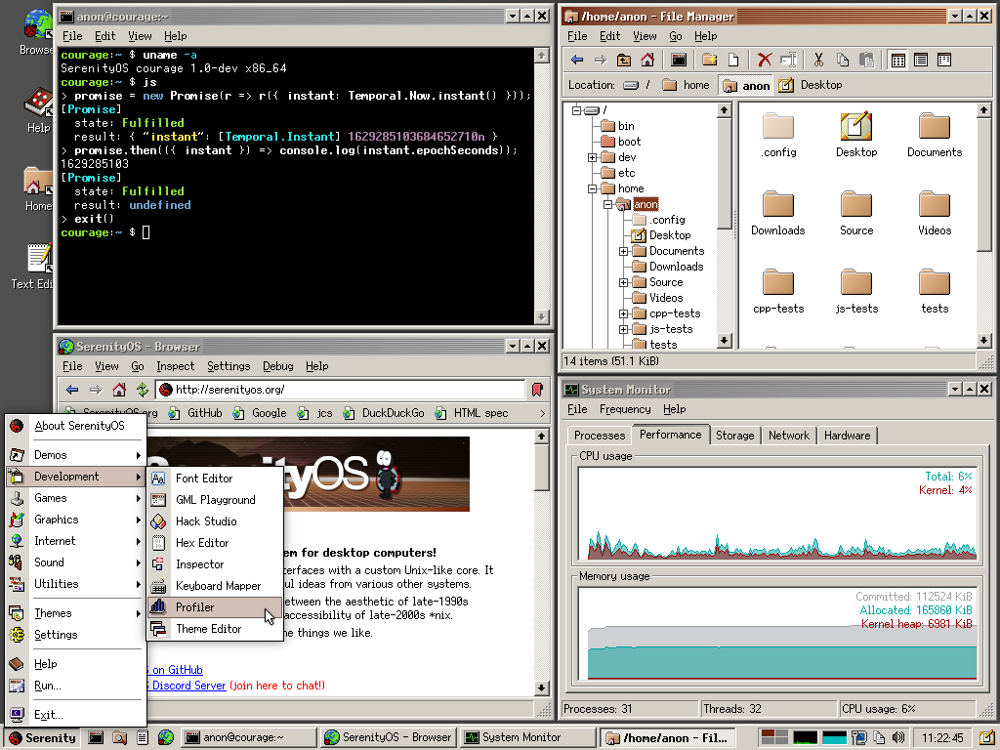
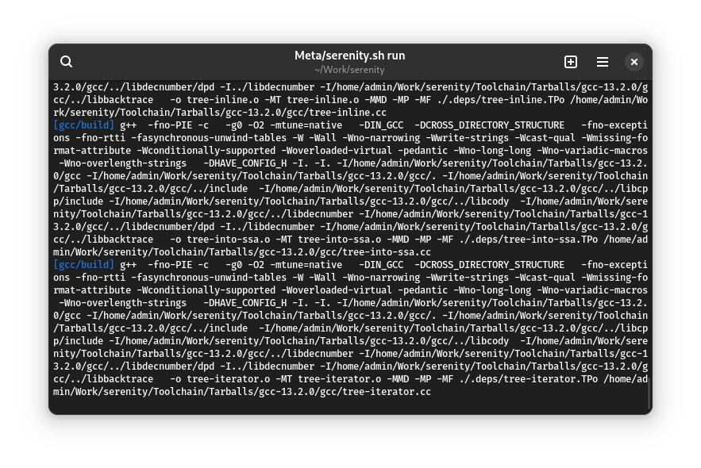
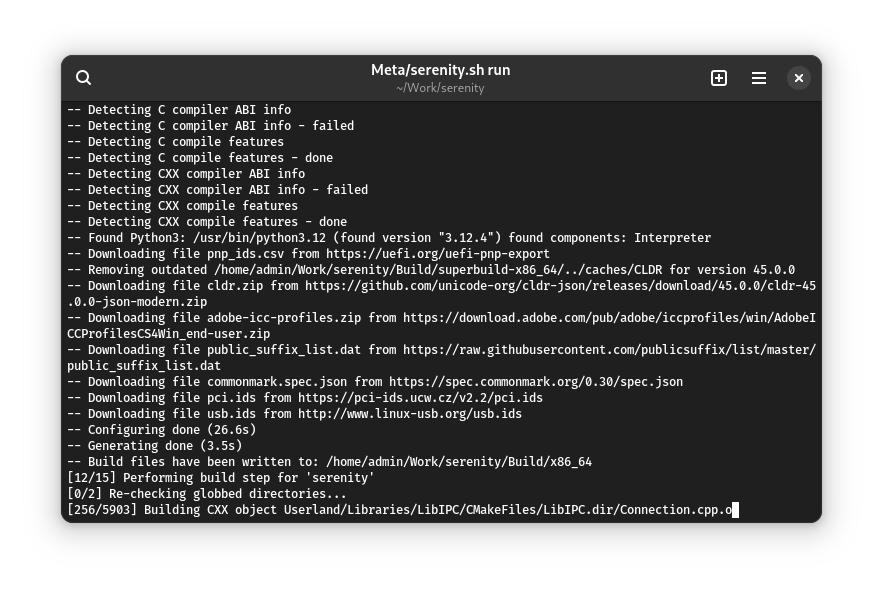

# Пару слов про SerenityOS

SerenityOS — любительская опреационная система семейства UNIX, разрабатываемая с 2018 года. Она предназначена для архитектуры x86, имеет своё собственное ядро и графический интерфейс «а-ля Windows 9x». Она написана с нуля на языке С++. Согласно [GitHub](https://github.com/SerenityOS/serenity/graphs/contributors), с 2018 по 2024 год в разработке SerenityOS так или иначе участвуют(участвовали) больше тысячи человек.

Этой статьёй я хотел бы начать обзор всевозможных «экзотических» ОС, разрабатываемых энтузиастами. Интересно не только рассказать про саму ОС, но и про какие-то её особенности, а также примерно понять, для какой аудитории подойдёт эта система, а также примерно угадать, что ждёт её в будущем.



<small>Скриншот взят с <a href="https://serenityos.org/">сайта</a> проекта.</small>

## Полезные ссылки

Перед прочтением статьи можете посетить ряд сайтов для более точного понимания, что же такое эта ваша SerenityOS:

- [Сайт проекта](https://serenityos.org/);
- [GitHub репозиторий](https://github.com/SerenityOS/serenity);
- [FaQ](https://serenityos.org/faq/);

## Получение ОС

Для начинающего пользователя получить эту ОС станет не так уж просто, ведь её загрузочных образов просто нет. Придётся собирать её из исходников самостоятельно, благо процесс сборки достаточно прост. <small>Далее я буду приводить инструкции по сборке, взятые из <a href="https://github.com/SerenityOS/serenity/blob/master/Documentation/BuildInstructions.md">документации этой ОС</a>. Я пользуюсь дистрибутивом Archlinux, поэтому инструкции будут даны относительно него. В принципе, если вы используете другой дистрибутив Linux, то все различия будут заключаться только лишь в установке необходимых зависимостей для сборки ОС.</small>

Для начала склонируйте репозиторий с ОС и перейдите в директорию с исходниками:

```bash
git clone https://github.com/SerenityOS/serenity
cd serenity
```

Теперь же требуется установить необходимое ПО для компиляции системы:

```bash
sudo pacman -S --needed      \
  base-devel cmake curl      \
  mpfr libmpc gmp e2fsprogs  \
  ninja qemu-desktop         \
  qemu-system-aarch64 ccache \
  rsync unzip
```

<small>Даже не знаю, зачем тут <tt>qemu-system-aarch64</tt>, ведь SerenityOS предназначена для x86_64. Может быть, в документации этой ОС ошибка?</small>

## Сборка ОС

Для сборки введите команду:

```bash
Meta/serenity.sh run
```

Этой командой вы начнёте сборку ОС, по завершении которой будет создан ряд файлов в директории `Build/x86_64/Root` и запущена виртуальная машина QEMU с собранной SerenityOS.

 | 
