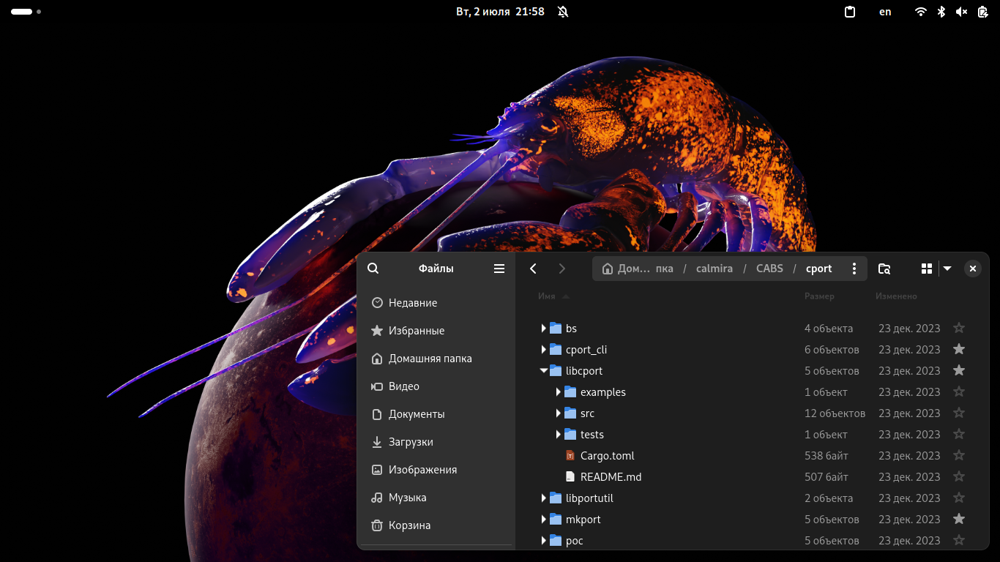
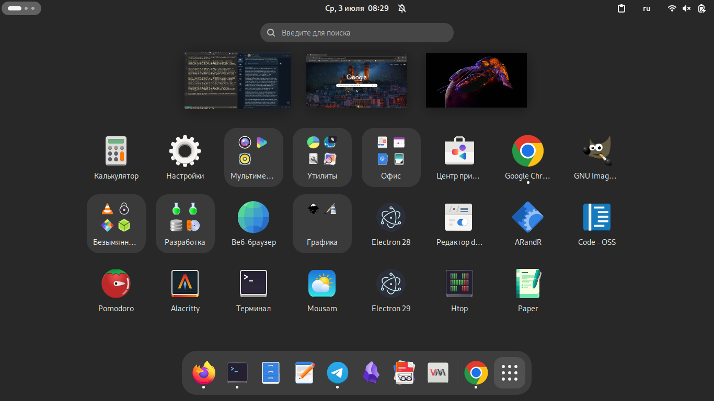

# Linux Desktop — почему всё так плохо? Дерьмовые рабочие окружения

[Статьи](README.md)

<small>02.07.2024</small>

В данном цикле статей хотелось бы опубликовать свои мысли по поводу того, почему Linux на десктопе так и не нашёл своего пользователя, и что, по моему мнению, нужно сделать, чтобы изменить эту ситуацию к лучшему.

С 2021 года я работаю над дистрибутивом Calmira GNU/Linux-libre — это т.н. «классический» дистрибутив GNU/Linux(-libre), который ставит в основу всего простоту и минимализм. Кроме Calmira мне приходилось работать ещё над некоторыми проектами в прошлом, уже канувшими в лету, так или иначе связанными с GNU/Linux. И чем больше я погружаюсь в строение дистрибутивов этой ОС, тем больше я испытываю к ним отвращение. В буквальном смысле этого слова: GNU/Linux сейчас является помойным ведром, в котором находятся костыли и велосипеды ещё из прошлого века, о которых нужно забыть. Например, это сервер Xorg, который хрен знает сколько лет находится буквально в состоянии стагнации, это один большой кусок Legacy с кучей багов и уязвимостей, а единственное «его» достоинство лишь в том, что он в силу своего возраста и крутизны в далёком прошлом существует буквально везде и 99,9% графического ПО для Unix-систем с ним совместимо. Либо это стандарт FHS, имеющий как свои достоинства, так и недостатки. Ну и костыли из настоящего вроде тех же пакетных менеджеров, которые в моём сознании представляются очень сложным (с точки зрения внутреннего дизайна) и неповоротливым убожеством. А давайте попробуем назвать **точное** количество всех *популярных* дистрибутивов GNU/Linux — основное их число мало чем отличается друг от друга, различия 90% которых заключаются разве что в названии, обоях по умолчанию и версиях предустановленного ПО, а фундаментально все они одинаковые: тот же пакетный менеджер, то же ядро Linux, та же система инициализации, тот же интернет-браузер по умолчанию, тот же набор рабочих окружений...

И это я не касался части другого ПО, с которым мы так или иначе взаимодействуем каждый день. Те же рабочие окружения, к примеру. Я не могу привести пример такого DE, которое, на мой взгляд, полностью подходит обычному человеку (будь то офисному работнику, программисту, студенту, etc.). MATE и TDE — это пережитки прошлого (форки GNOME 2 и KDE 3 соотв.), смысла от них не так много, поскольку ничего нового в Linux Desktop они привнести не могут по определению. Xfce страшна как смерть, а также (опять же на мой взгляд!) неудобна, и не надо тут говорить про богатство её настроек, ведь какой смысл от обилия параметров и иных функций, если само по себе рабочее окружение так же как и MATE/TDE застряло в нулевых — я могу поставить какую-то весёленькую тему оформления, чтобы «осовременнить» внешний вид окружения, но это будет лишь фасад, скрывающий под собой концепты и решения из прошлых десятилетий...

KDE обладает просто огромным числом функций, но нужны ли они пользователю? С точки зрения пользовательского опыта KDE — это ахтунг. Взять те же параметры. Чтобы изменить обои на рабочем столе, экране блокировки и экране входа в систему, мне нужно посетить **ТРИ не связанных друг с другом** пункта настроек этого омерзительного рабочего окружения, один из которых до недавнего времени вообще не являлся частью «Параметров системы», а был доступен только из контекстного меню рабочего стола. Конечно, «Параметры» этого DE содержат поиск, но хорошо ли, когда я вынужден пользоваться поиском для доступа к *элементарным* параметрам системы? В хорошем интерфейсе всё, что часто нужно и важно для пользователя, вынесено на первый план, а весь мало востребованный «мусор» либо отсутствует вообще, либо скрыт, либо находится на втором плане. У KDE же подход совсем другой, этот уродец как бы говорит нам:

> Настрой меня полностью. Целыми днями проводи за настройкой моего внешнего вида. Сделай из меня некрасивого неполноценного и неудобного мутанта. А твоя драгоценная работка может подождать.

Пользователю зачастую не нужно огромное число функций и настроек, да и любой адекватный пользователь любит включить компьютер и начать сразу работать за ним. Когда он поставил нужное ПО и сразу перешёл к взаимодействию с ним, когда он может приступить к работе, а не к вечному допиливанию и перенастроке.

Рабочее окружение — это «прослойка» между операционной системой и пользователем. Следовательно, эта прослойка должна быть максимально простой и удобной (а также надёжной, чего не скажешь о KDE), дабы пользователь не отвлекался на неё, а занимался своими делами. Мы же после покупки молотка не занимаемся его настройкой и допиливанием для своих нужд. Тоже самое и с нормальным окружением операционной системы.

Совсем иным на фоне KDE выглядит GNOME. Конечно, у него ещё есть куча проблем, но в целом мне нравится тот путь развития, который выбрали разработчики этого DE. Отказавшись от сторонних тем оформления и используя только свою Adwaita (в светлом и тёмном варианте), а также радикальным образом изменив UI/UX окружения, разработчики не только упростили его, но и сделали его узнаваемым. У GNOME *есть своё лицо*, а это хорошо. Если мне кто-то показывает скриншот своей Windows, то я понимаю, что передо мной Windows. Если мне кто-то говорит про macOS, то я сразу же вспоминаю панель сверху, док снизу и потрясающий продуманный и элегантный интерфейс. Ну а если я где-то увижу GNOME, то я также его легко узнаю. У любого крупного массового продукта **должно быть своё *лицо*** — разработчики GNOME это поняли. Лишив своё детище ряда параметров, разработчики оставили его только с тем, что действительно необходимо, а с рядом изменений в UI/UX они сделали окружение простым для взаимодействия с ним. Конечно, я не говорю, что в последних версиях GNOME всё так красиво и удобно, вовсе нет: новым пользователям не всегда понятно, почему тут нет иконок на рабочем столе, а также куда делись кнопки «Свернуть» и «Развернуть» из заголовков окна. Для новых пользователей GNOME по прежнему не всегда понятен, но тут самое главное — понять логику взаимодействия с ним и его философию. Если человек поймёт всё это, то GNOME его потом не отпустит: он просто не сможет пользоваться чем-либо другим на постоянной основе (я пользуюсь GNOME на протяжении почти пяти лет).

Есть у GNOME и проблемы. Во-первых, это меню «Обзор». У него есть несколько проблем, среди которых — скучный серый фон (см. фото выше). Ноутбуки/мониторы обычно чёрного цвета, по крайней мере чёрного цвета цвет рамки вокруг экрана. А обзор скучного серого цвета. Не сочитается и сильно выбивается. Уж лучше, чтобы было либо как раньше (прозрачный фон), либо же как «Обзор» в KDE, имеющий размытый фон. Ну либо уж полностью чёрный фон: такой же, как и верхняя панель.

Кроме того, о чём я также много раз писал, это неинуитивность UX для новых пользователей. Когда я только поставил GNOME, я поначалу не понял, где тут панель задач и кнопки «Свернуть» и «Развернуть». Новички часто задают вопросы:

> Как тут переключаться между окнами?

> Где тут рабочий стол?

> Как входить в главное меню?

Например, в Ubuntu GNOME сильно видоизменённый: там есть и иконки рабочего стола, и док выведен из «Обзора» и доступен всегда, и в заголовках окон присутствуют привычные всем кнопки для сворачивания и разворачивания окон. Но Ubuntu — одна из немногих, и зачастую некоторые люди знакомятся с «ванильным» GNOME без всех этих изменений.

Будут ли разбираться пользователи в непонятном для них интерфейсе? Если он для них первый, то, наверное, да. А вот если человек перешёл с Windows/macOS, то скорее всего нет. Им просто не до этого: вместо того, чтобы разбираться в тонкостях взаимодействия с окружением, им нужно работу работать. А как работать эту вашу работу, если они не могут даже понять, как тут запускать нужные программы?

Безусловно, мне очень нравится дефолтный GNOME без всех этих ~костылей~ расширений типа Dash to Dock, Desktop Icons и пр. Я использую GNOME без этого всего и мне нормально. Но тут дело в том, что я давным давно разобрался в этом окружении и оно мне нравится таким, какое оно есть.

Во-вторых, хорошее рабочее окружение должно выглядеть целостно и монолитно. Отчасти это применимо и к GNOME, однако приложения, написанные с применением тулкитов GTK 3 или Qt выглядят в нём инородно. Для GTK3-приложений помогает использование темы оформления `adw-gtk3`, для Qt пока ещё нет нормальных тем в стиле libadwaita. Была какая-то тема, копирующая «старую» версию Adwaita, но выглядела она настолько ужасно, что я первым делом ставил стандартную тему Qt чтобы не видеть всего этого позора.

В-третьих, язык программирования, на котором написана оболочка. Вся логика GNOME Shell написана на C, однако вот всё, что видит пользователь (панель, обзор, меню приложений, экран блокировки, etc.), написано на JavaScript. Да, это простой язык, понятный многим разработчикам, и с точки зрения развития ранних версий GNOME Shell это, однозначно, плюс. Однако в итоге производительность GNOME может быть несколько ниже, а вот потребление ресурсов ПК несколько выше. Я никогда не понимал, а почему бы не использовать развиваемый проектом GNOME язык программирования Vala? Он тоже простой, но всё-таки побыстрее JavaScript. По крайней мере код, написанный на Vala, не интерпретируется, а транслируется в код на языке C, а потом компилируется компилятором GCC. В итоге мы получаем обычный бинарник в формате ELF, который можем легко запустить без применения всяких медленных и жрущих интерпретаторов.

---

Отдельной историей является также и обратная связь оболочки к пользователю. Мне нужно было смонтировать образ (в GNOME это делается просто двойным кликом по образу iso/img в файловом менеджере), чтобы достать из него нужные мне файлы. Однако образ был битым и монтироваться не хотел. Я не знал об этом, а рабочее окружение мне об этом не сказало, когда я пытался его смонтировать. Никаких сообщений об ошибке выведено не было! В итоге я был вынужден открыть терминал и смонтировать образ через него. И, о чудо (!), команда `mount` вывела сообщение об ошибке! Так почему у консольного ПО обратная связь лучше, чем у графического?

Второй пример: мне нужно было запустить скомпилированный на другом компьютере двоичный файл. В GNOME это делается так же просто: обычный двойной клик по программе в файловом менеджере. Но я забыл про то, что эта программа требует библиотеку, которой у меня на компьютере нет. Как итог, программа не запустилась. В Windows или macOS было бы выведено графическое окно с текстом ошибки: мол, пользователь, ты тут немного дурачок — у тебя библиотек нужных нет, хрен я тебе чо запущу! Но не в Linux же. Тут никаких окон с текстом ошибки выведено не было. В итоге мне пришлось опять открывать терминал и запускать программу через него. И, о чудо (!!!), в терминал было выведено сообщение о том, что в системе нет нужных библиотек для запуска программы!

Я не вижу ничего плохого в терминале. Однако раз уж графический интерфейс (в данном случае рабочее окружение) предоставляет функционал, потенциально вызывающий ошибки, то графический интерфейс в случае возникновения ошибки всё-таки должен предупреждать пользователя о том, что такая-то ошибка произошла. Но ни одно DE в GNU/Linux этого не делает.

[Предлагаю ознакомиться со статьёй](https://habr.com/ru/companies/slurm/articles/461141/) создателя формата AppImage (по ссылке переведённая на русский язык версия). В конце этой статьи (пункт «Динамические библиотеки») он говорит о том же, о чём писал я. Так почему же интерфейс ОС Haiku, которая намного проще Linux, имеет хорошую обратную связь и предупреждает пользователя о том, что возникла какая-то ошибка, а вот интерфейсы в Linux так не делают?

- [К слову, в GNOME это не могут реализовать уже 4 (!!!) года](https://gitlab.gnome.org/GNOME/nautilus/-/issues/1166)
- [Ну и в KDE](https://bugs.kde.org/show_bug.cgi?id=409777)

## Итог

1. Хорошее рабочее окружение должно быть простым и интуитивно понятным. У него не должно быть очень много настроек. DE должно предоставлять только самое необходимое.
2. Хорошее рабочее окружение должно иметь узнаваемый современный удобный дизайн. Когда мы говорим «Windows», мы вспоминаем одну ОС, когда мы говорим «macOS», мы вспоминаем другую ОС с другим внешним видом. Когда мы говорим «Linux», мы так же должны вспоминать это рабочее окружение. Его дизайн должен выражать сам себя.
3. У хорошего рабочего окружения должна быть хорошая обратная связь. Если какая-то функция окружения потенциально может выдавать сообщение об ошибке, то нужно предусмотреть и функционал для того, чтобы это сообщение об ошибке «доставить» пользователю. Чтобы он увидел эту ошибку. А не прибегал к иным интерфейсам для того, чтобы узнать, была ли ошибка или нет (к тому же терминалу, например).
4. Мне нравится рабочее окружение GNOME. Оно имеет своё лицо: узнаваемый и практичный дизайн. Он не без недостатков (описано выше), но разработчикам и дизайнерам есть куда расти и они постепенно основные недостатки исправляют. Лично для меня GNOME является «лицом» для GNU/Linux. Никакие KDE, Xfce, MATE и прочий кал. Только GNOME.
