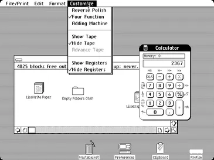
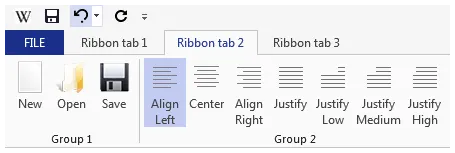
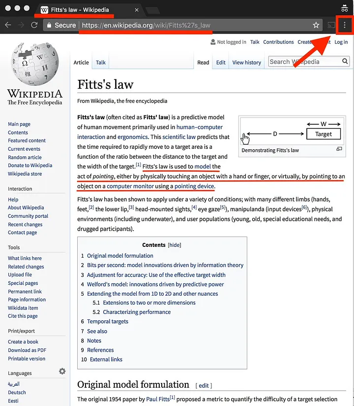
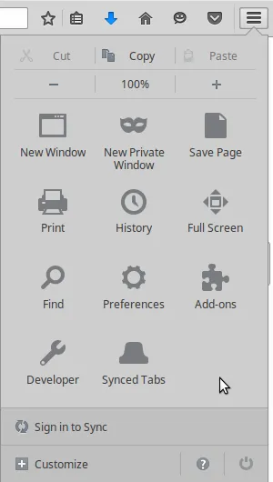

# Сделай. Это. Проще. Удобство использования Linux Desktop — Часть 1

*Почему рабочие окружения для настольных компьютеров всё больше ухудшают UX, который когда-то был простым и «здравым»? Существует ли тайный план по уничтожению десктопов путём их заражения менее подходящими концепциями UX, придуманных для мобильных устройств? В этой серии я рассмотрю последние тревожные тенденции в юзабилити десктопных Linux и сравню их с мыслями изобретателей той самой метафоры интерфейса настольного компьютера, какой мы её знаем.*

> **Примечание переводчика:**
>
> Это перевод [первой части статьи](https://medium.com/@probonopd/make-it-simple-linux-desktop-usability-part-1-5fa0fb369b42) из цикла [#LinuxUsability](../). Автор оригинала: [@probonopd](https://medium.com/@probonopd/), также известный как создатель формата самодостаточных пакетов AppImage.

***

Позвольте сначала сказать: *мне нравится рабочий стол Linux. Я забочусь о Linux Desktop. Мне нравятся обсуждаемые здесь проекты*, и я ценю тяжёлую работу, которые люди над ними проделывают. *Но я хотел бы видеть, как Linux Desktop улучшается*. И я думаю, что нужно трезво оценивать происходящее, ведь не всегда всё меняется к лучшему.

Что ж, давайте же начнём... Пользовательский опыт в Linux хороший, странный и откровенно уродливый. Для краткости я пропущу всё самое хорошее.

## Меню

В рабочих окружениях и приложениях наблюдается тенденция к изменению проверенной концепции меню.

[Билл Аткинсон](https://en.wikipedia.org/wiki/Bill_Atkinson), изобретатель меню в том виде, в котором мы их знаем, говорит:

> Я горжусь выпадающими меню. Мне показалось, что выпадающее меню — очень хорошее решение для обеспечения наглядности и развития пространственной памяти для запоминания того, где находятся команды.

Источник: [Computer History Museum, Oral History of Andy Hertzfeld and Bill Atkinson](http://archive.computerhistory.org/resources/access/text/2013/05/102658007-05-01-acc.pdf).

Почему существует эта тревожная тенденция убивать любимые меню **«Файл, Правка,...»**, которые восходят к дизайну пользовательского интерфейса [Lisa](https://en.wikipedia.org/wiki/Apple_Lisa) и отложились у нас на подкорках в течение последних 40 лет?

<small>Меню «Файл», «Правка», ... около 1980 г. в интерфейсе Lisa. Источник: <a href="https://en.wikipedia.org/wiki/File:Apple_Lisa_Office_System_3.1.png">Wikimedia</a></small>

Как описывает Билл Аткинсон:

> Была ещё одна приятная особенность: поскольку заголовки меню всегда были немного уже, чем сами эти пункты, это практически втрое увеличивало доступное место на экране (прим. переводчика: по всей видимости, под «заголовками» здесь подразумеваются названия этих пунктов, которые находятся в верхней панели). **Вы могли «просканировать» верхнюю часть экрана и увидеть все доступные команды, не выполняя ни одной из них.** Вы можете без вреда для себя **посмотреть, что доступно.**

С помощью меню вы можете щёлкнуть на меню, удерживая кнопку мыши и перемещая её (мышь — прим. переводчика) по горизонтали, чтобы сразу увидеть все доступные команды/функции приложения.

В интервью 2003 года ветеран [Xerox PARC](https://en.wikipedia.org/wiki/PARC_(company)) и Apple [Ларри Теслер](https://en.wikipedia.org/wiki/Larry_Tesler) так говорит о Билле Аткинсоне в 1982 году:

> Билл отправился домой; за одну ночь он разработал всю систему выпадающих меню! Всю! Он не просто перенёс её в верхнюю часть экрана; он придумал, что при исследовании её мышью каждое меню будет опускаться вниз, и они будут рябить при движении вперёд-назад и появляться так, чтобы **вы могли изучить их все...** Он придумал всё это за одну ночь! Я не могу представить, что произошло той ночью.

Источник: [designinginteractions.com](http://www.designinginteractions.com/downloads/DesigningInteractions_2.pdf)

Посмотрите это интервью с Биллом Аткинсоном: <http://www.designinginteractions.com/interviews/BillAtkinson?source=post_page-----5fa0fb369b42--------------------------------> (эта ссылка, похоже, битая — прим. переводчика).

С тех пор, как Microsoft представила интерфейс [Ribbon](https://en.wikipedia.org/wiki/Ribbon_(computing)), никто больше не находит никаких команд/функций. По крайней мере, я не нахожу. И похоже, что я не один такой, иначе зачем существует [целая страница, посвящённая поиску «Paste Special»](https://support.microsoft.com/en-us/office/paste-special-e03db6c7-8295-4529-957d-16ac8a778719)?

<small>Лента (Ribbon) вместо меню. Источник: <a href="https://commons.wikimedia.org/wiki/File:Example_of_a_ribbon_(user_interface_element).png">Wikimedia</a></small>

Это не только отличается, но и является *большим шагом назад* по сравнению с тем, что Apple придумала около 40 лет назад. С лентой (Ribbon)? Чтобы увидеть все функции программы, приходится переходить по всем вкладкам. «Paste Special» — это <kbd>Ctrl</kbd>+<kbd>Alt</kbd>+<kbd>V</kbd>, но как я могу об этом узнать, глядя на эту ленту? В меню это было бы красиво напечатано рядом с командой.

Аналогичным образом, что, возможно, ещё хуже, в веб-браузерах (а теперь ещё и в ПО от GNOME и KDE — прим. переводчика) существует прискорбная тенденция уходить от меню в какое-то непонятное «[меню-гамбургер](https://en.wikipedia.org/wiki/Hamburger_button)», расположенное в странном месте на экране.

<small>Браузер Google Chrome использует неузнаваемую иконку вместо строки меню. Источник: <a href="https://twitter.com/pdfkungfoo/status/938243776946024448">Twiiter</a></small>

И версия этого меню в Firefox:

<small>В браузере Firefox вместо строки меню используется аналогичная концепция</small>

Имея строку меню, вы можете попасть в диалоговое окно «О программе» одним щелчком и перетаскиванием мыши (ну или в любое другое диалоговое окно — прим. переводчика). С меню-гамбургером вам нужно минимум три щелчка, и вы должны знать, где вам нужно щёлкнуть. **Гигантский шаг назад** без видимых преимуществ. Проверенные временем концепции UX для настольных компьютеров, похоже, приглушены в попытке превратить эффективный и продуктивный пользовательский опыт в опыт громоздкий, похожий на смартфон.

И эта ерунда не ограничивается веб-браузерами, GNOME 3 — явно худший в своём классе:

<small>GNOME 3 в Ubuntu 17.04 скрывает то, что раньше было меню, в «меню-гамбургер»</small>

