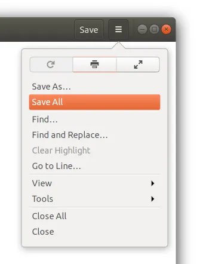
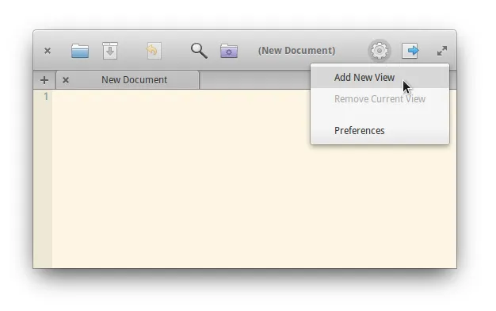
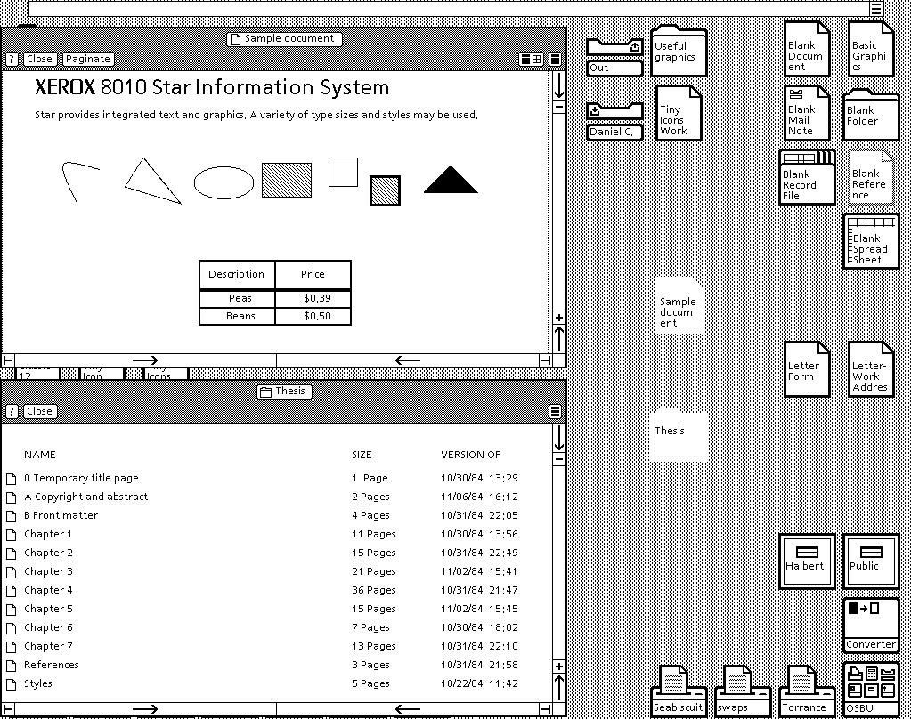
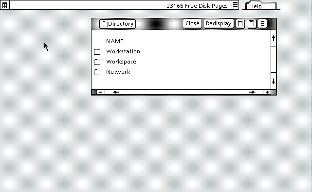
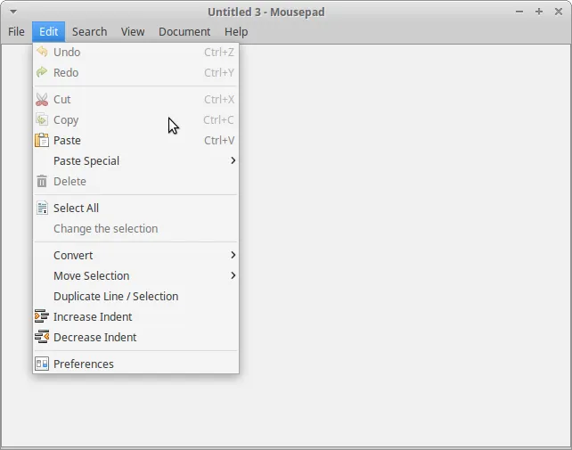
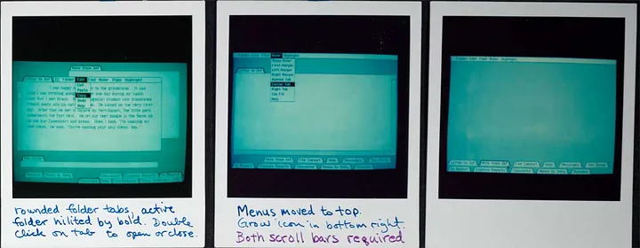
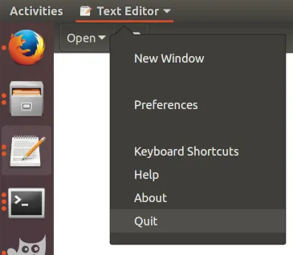
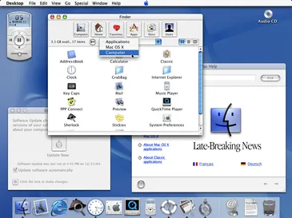
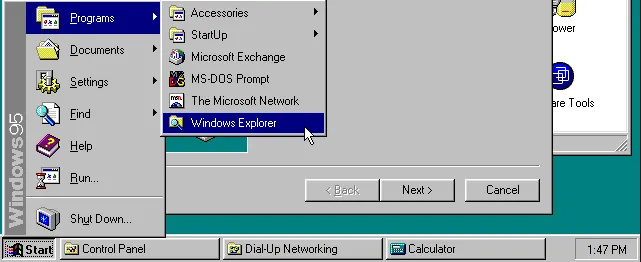

# Сделай. Это. Проще. Удобство использования Linux Desktop — Часть 1

*Почему рабочие окружения для настольных компьютеров всё больше ухудшают UX, который когда-то был простым и «здравым»? Существует ли тайный план по уничтожению десктопов путём их заражения менее подходящими концепциями UX, придуманных для мобильных устройств? В этой серии я рассмотрю последние тревожные тенденции в юзабилити десктопных Linux и сравню их с мыслями изобретателей той самой метафоры интерфейса настольного компьютера, какой мы её знаем.*

> **Примечание переводчика:**
>
> Это перевод [первой части статьи](https://medium.com/@probonopd/make-it-simple-linux-desktop-usability-part-1-5fa0fb369b42) из цикла [#LinuxUsability](../). Автор оригинала: [@probonopd](https://medium.com/@probonopd/), также известный как создатель формата самодостаточных пакетов AppImage.

***

Позвольте сначала сказать: *мне нравится рабочий стол Linux. Я забочусь о Linux Desktop. Мне нравятся обсуждаемые здесь проекты*, и я ценю тяжёлую работу, которые люди над ними проделывают. *Но я хотел бы видеть, как Linux Desktop улучшается*. И я думаю, что нужно трезво оценивать происходящее, ведь не всегда всё меняется к лучшему.

Что ж, давайте же начнём... Пользовательский опыт в Linux хороший, странный и откровенно уродливый. Для краткости я пропущу всё самое хорошее.

## Меню

В рабочих окружениях и приложениях наблюдается тенденция к изменению проверенной концепции меню.

[Билл Аткинсон](https://en.wikipedia.org/wiki/Bill_Atkinson), изобретатель меню в том виде, в котором мы их знаем, говорит:

> Я горжусь выпадающими меню. Мне показалось, что выпадающее меню — очень хорошее решение для обеспечения наглядности и развития пространственной памяти для запоминания того, где находятся команды.

Источник: [Computer History Museum, Oral History of Andy Hertzfeld and Bill Atkinson](http://archive.computerhistory.org/resources/access/text/2013/05/102658007-05-01-acc.pdf).

Почему существует эта тревожная тенденция убивать любимые меню **«Файл, Правка,...»**, которые восходят к дизайну пользовательского интерфейса [Lisa](https://en.wikipedia.org/wiki/Apple_Lisa) и отложились у нас на подкорках в течение последних 40 лет?

<small>Меню «Файл», «Правка», ... около 1980 г. в интерфейсе Lisa. Источник: <a href="https://en.wikipedia.org/wiki/File:Apple_Lisa_Office_System_3.1.png">Wikimedia</a></small>

Как описывает Билл Аткинсон:

> Была ещё одна приятная особенность: поскольку заголовки меню всегда были немного уже, чем сами эти пункты, это практически втрое увеличивало доступное место на экране (прим. переводчика: по всей видимости, под «заголовками» здесь подразумеваются названия этих пунктов, которые находятся в верхней панели). **Вы могли «просканировать» верхнюю часть экрана и увидеть все доступные команды, не выполняя ни одной из них.** Вы можете без вреда для себя **посмотреть, что доступно.**

С помощью меню вы можете щёлкнуть на меню, удерживая кнопку мыши и перемещая её (мышь — прим. переводчика) по горизонтали, чтобы сразу увидеть все доступные команды/функции приложения.

В интервью 2003 года ветеран [Xerox PARC](https://en.wikipedia.org/wiki/PARC_(company)) и Apple [Ларри Теслер](https://en.wikipedia.org/wiki/Larry_Tesler) так говорит о Билле Аткинсоне в 1982 году:

> Билл отправился домой; за одну ночь он разработал всю систему выпадающих меню! Всю! Он не просто перенёс её в верхнюю часть экрана; он придумал, что при исследовании её мышью каждое меню будет опускаться вниз, и они будут рябить при движении вперёд-назад и появляться так, чтобы **вы могли изучить их все...** Он придумал всё это за одну ночь! Я не могу представить, что произошло той ночью.

Источник: [designinginteractions.com](http://www.designinginteractions.com/downloads/DesigningInteractions_2.pdf)

Посмотрите это интервью с Биллом Аткинсоном: <http://www.designinginteractions.com/interviews/BillAtkinson?source=post_page-----5fa0fb369b42--------------------------------> (эта ссылка, похоже, битая — прим. переводчика).

С тех пор, как Microsoft представила интерфейс [Ribbon](https://en.wikipedia.org/wiki/Ribbon_(computing)), никто больше не находит никаких команд/функций. По крайней мере, я не нахожу. И похоже, что я не один такой, иначе зачем существует [целая страница, посвящённая поиску «Paste Special»](https://support.microsoft.com/en-us/office/paste-special-e03db6c7-8295-4529-957d-16ac8a778719)?

<small>Лента (Ribbon) вместо меню. Источник: <a href="https://commons.wikimedia.org/wiki/File:Example_of_a_ribbon_(user_interface_element).png">Wikimedia</a></small>

Это не только отличается, но и является *большим шагом назад* по сравнению с тем, что Apple придумала около 40 лет назад. С лентой (Ribbon)? Чтобы увидеть все функции программы, приходится переходить по всем вкладкам. «Paste Special» — это <kbd>Ctrl</kbd>+<kbd>Alt</kbd>+<kbd>V</kbd>, но как я могу об этом узнать, глядя на эту ленту? В меню это было бы красиво напечатано рядом с командой.

Аналогичным образом, что, возможно, ещё хуже, в веб-браузерах (а теперь ещё и в ПО от GNOME и KDE — прим. переводчика) существует прискорбная тенденция уходить от меню в какое-то непонятное «[меню-гамбургер](https://en.wikipedia.org/wiki/Hamburger_button)», расположенное в странном месте на экране.

<small>Браузер Google Chrome использует неузнаваемую иконку вместо строки меню. Источник: <a href="https://twitter.com/pdfkungfoo/status/938243776946024448">Twiiter</a></small>

И версия этого меню в Firefox:

<small>В браузере Firefox вместо строки меню используется аналогичная концепция</small>

Имея строку меню, вы можете попасть в диалоговое окно «О программе» одним щелчком и перетаскиванием мыши (ну или в любое другое диалоговое окно — прим. переводчика). С меню-гамбургером вам нужно минимум три щелчка, и вы должны знать, где вам нужно щёлкнуть. **Гигантский шаг назад** без видимых преимуществ. Проверенные временем концепции UX для настольных компьютеров, похоже, приглушены в попытке превратить эффективный и продуктивный пользовательский опыт в опыт громоздкий, похожий на смартфон.

И эта ерунда не ограничивается веб-браузерами, GNOME 3 — явно худший в своём классе:

<small>GNOME 3 в Ubuntu 17.04 скрывает то, что раньше было меню, в «меню-гамбургер»</small>

Но это касается не только GNOME. Похоже, идёт крестовый поход за уничтожение меню. Дизайн elementaryOS стал ещё хуже. Иконка «Настройки» — это всё, что осталось от меню. Где копирование, где вставка?

<small>Текстовый редактор в elementaryOS 0.3</small>

После первоначальной публикации этой статьи я был потрясён, узнав, что у [Xerox Star] было меню-гамбургер в 1981 году (до появления Lisa и Macintosh) — посмотрите внимательно:

<small>Пользовательский интерфейс Xerox Star (1981 год). Источник: <a href="http://toastytech.com/guis/gv.html">GUI Gallery</a></small>

Я был ещё больше потрясён, когда узнал, что это меню делало то же самое, что и меню-гамбургер сегодня:

<small>Меню-гамбургер в XEROX Star</small>

[Более подробная история значка габмургера](https://gizmodo.com/who-designed-the-iconic-hamburger-icon-1555438787).

Итак, по сути, Firefox, GNOME 3 и др. отбросили улучшения графического интерфейса Lisa/Macintosh и вернулись к графическому интерфейсу Xerox 1981 года.

> **В каждом пользовательском приложении должна быть традиционная строка меню.**

Приложения для настольных компьютеров не должны пытаться имитировать приложения для мобильных телефонов, которые были разработаны для сенсорного управления — «меню-гамбургеры» могут быть подходящим компромиссом для перегруженных мобильников, но не для современных настольных систем с экранами Full HD или 4K.

## Комбинации клавиш в меню

Снова посмотрите на скриншот GNOME 3. Можете сказать, что здесь отсутствует? Отсутствует визуальная подсказка, что Сохранить — это <kbd>Ctrl</kbd>+<kbd>S</kbd>. Пункты меню «Копировать», «Вставить» и т.д. полностью отсутствуют — не только их комбинации, как <kbd>Ctrl</kbd>+<kbd>C</kbd>, но и все пункты меню (прим. переводчика — прошу не докапываться до названий пунктов «Копировать», «Вставить», это просто как пример. На самом деле, мне тоже не хватало обозначений комбинаций клавиш в GTK3-софте, благо, в новом GTK4+libadwaita обозначения комбинаций клавиш в меню-гамбургеры вернулись).

<small>В GNOME 3 в Ubuntu 17.04 отсутствует меню «Правка» и комбинации клавиш</small>

*Что?* Объясняет Билл Аткинсон:

<https://www.youtube.com/watch?v=-syl7m_i-80&feature=youtu.be&t=31m59s>

<iframe src="https://www.youtube.com/embed/-syl7m_i-80" title="MacPaint Interview and Demonstration, with Bill Atkinson and Andy Herzfeld" frameborder="0" allow="accelerometer; autoplay; clipboard-write; encrypted-media; gyroscope; picture-in-picture; web-share" referrerpolicy="strict-origin-when-cross-origin" allowfullscreen></iframe>

XFCE правильно понимает основы — использование меню и комбинаций клавиш в меню. Я никогда бы не ожидал, что это станет чем-то, о чём нужно говорить особо, но пример GNOME выше показывает, что, очевидно, мы больше не можем воспринимать основы как должное.

<small>Меню «Edit» («Правка») в XFCE в Ubuntu 16.04</small>

*В каждом приложении должны быть комбинации клавиш, которые интуитивно понятны, потому что они чётко обозначены в меню.*

## Строка глобального меню

**[Закон Фиттса](https://en.wikipedia.org/wiki/Fitts%27s_law)**, о котором вскользь упоминалось выше, уже должен быть знаком в кругах UX. Из него также следует, что наличие глобальных панелей меню лучше, чем наличие панелей меню для каждого окна, потому что вам гораздо проще добраться до верхней части экрана, быстро переместив туда мышь, а не наводя её с высокой точностью.

Эта концепция восходит к Lisa, которая была разработана в начале 80-х годов, а возможно, и раньше.

<small>Ранние прототипы графического интерфейса Lisa, около 1980 года. Источник: <a href="https://www.folklore.org/StoryView.py?story=Busy_Being_Born.txt">folklore.org</a>. Лицензия: Добросовестное использование исторического артефакта</small>

Ранний сотрудник Apple Энди Херцфельд [подробно рассказывает о том](https://www.folklore.org/StoryView.py?story=Busy_Being_Born.txt), как зарождался графический интерфейс Apple:

> Средний рисунок представляет собой **настоящий прорыв: строка меню находится в верхней части экрана**, а не в верхней части каждого окна.

Прошло *почти 40 лет*, и вот что сделали рабочие окружения Linux из этого прорыва в UX:

<small>Глобальное меню состоит только из одной кнопки с 6 пунктами в GNOME 3 из Ubuntu 17.10</small>

В GNOME 3 есть то, что кажется глобальной строкой меню, но она не отображает пункты меню приложения, а тратит самое драгоценное место на экране, помещая часы прямо в центр этой строки.

<small>Часы в центре панели с глобальным меню, 2017</small>

> **Примечание переводчика:**
>
> Я прекрасно помню то время, это было, наверное, когда Ubuntu только-только отказалась от своего [потрясающего на тот момент] окружения Unity7 в пользу обычного GNOME. Тогда мне нужно было зайти в настройки файлового менеджера (Nautilus), и я не понял, где они. В меню-гамбургере их тогда ещё не было. В итоге я обматерил разработчиков Ubuntu (и заодно ещё и GNOME), и откатился до версии 16.04 с Unity. В итоге, кнопка для входа в настройки была вот в том меню-кастрате, что находилось в верхней панели.
>
> Это верхнее меню — самое плохое и неинтуитивное, что только могло быть. В итоге, в нём к последним версиям GNOME осталось наверное кнопки две или три, не связанные с функционалом приложения, а предназначенные для закрытия окна и выполнения каких-то подобных действий. В итоге у разработчиков GNOME хватило ума отказаться в последних версиях от этого недоразумения.

Кстати, Apple совершила похожую ошибку в начале работы над Mac OS X. Да, это логотип Apple, расположенный в центре строки меню:

<small>Логотип Apple в центре строки глобального меню, около 2000 года в бета-версии Mac OS X. Источник: <a href="https://en.wikipedia.org/wiki/Mac_OS_X_Public_Beta#/media/File:Macosxpb.png">Wikimedia</a></small>

Но в отличие от GNOME, Apple быстро осознала эту проблему и исправила её ещё до того, как первый релиз Mac OS X увидел свет.

> **Примечание переводчика:**
>
> В 20-х годах этого столетия они совершили ту же самую ошибку, поместив в верхнюю часть экрана вырез с веб-камерой (прямо как на мобильниках). Теперь камера закрывает это глобальное меню в середине — прямо в том месте, где в Beta-версиях Mac OS X 10.0 был логотип Apple. Так что история циклична, но в современности Apple не хватило мозгов исправить эту проблему, как они сделали в двухтысячных.

В Xubuntu есть то, что на первый взгляд выглядит как глобальная панель меню, но на самом деле это панель, как в Windows 95, перенесённая наверх.

<small>Панель XFCE в верхней части экрана в Xubuntu 16.04</small>

<small>Панель задач и меню «Пуск» в Windows 95. Лицензия: добросовестное использование</small>

Я хочу сказать, что «поддержка глобального меню» не очень подходит, если оно не является стандартным. Unity была [убита](https://arstechnica.com/information-technology/2017/04/ubuntu-unity-is-dead-desktop-will-switch-back-to-gnome-next-year/) Canonical вместе со многими другими инициативами. Я никогда не слышал о [Plotinus](https://github.com/p-e-w/plotinus) (см. ниже) и Krunner, и я сомневаюсь, что большинство других пользователей десктопов на Linux про них слышали. Эти инструменты не обнаруживаются, не выскакивают прямо на глаза (прим. переводчика — если KRunner — это именно то, о чём я подумал (строка поиска в KDE Plasma с 4 по 6 версии), то в последний версиях плазмы стали больше рассказывать про эту приблуду).

*Должна быть глобальная строка меню. И в ней должны быть привычные пункты «Файл», «Правка»,... (Так грустно, что даже это уже нельзя воспринимать как должное!)*

## Поиск в меню
