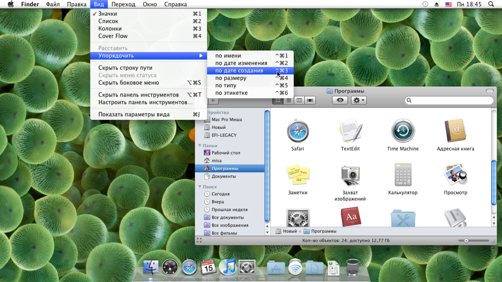

# Сделай. Это. Проще. Удобство использования Linux Desktop[^1]

<small>Десктоп, который мы потеряли. Вот на кого Linux'y нужно равняться!</small>

В данном разделе представлены переводы [цикла статей](https://medium.com/@probonopd/make-it-simple-linux-desktop-usability-part-1-5fa0fb369b42) от автора формата AppImage «Make. It. Simple. Linux Desktop Usability».

## Содержание

- [Часть 1. Меню](1/README.md)
- Часть 2
- Часть 3
- Часть 4
- Часть 5
- Часть 6

[^1]: В данном случае под словом «desktop», вероятно, подразумевается компьютер, за котором работают обычные люди, а не системные администраторы или разработчики ОС (прим. переводчика).

---

## Поддержать переводчика

Переводчику этих статей требуется новый ноутбук, на котором он смог бы продолжить свою работу. Поскольку техника в России стоит очень дорого, вы можете отправить ему донат, чтобы приобрести новый компьютер быстрее:

> **2202206252335406** (Сбербанк)

Заранее спасибо!
