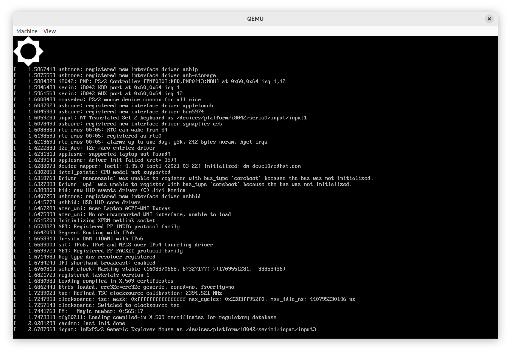
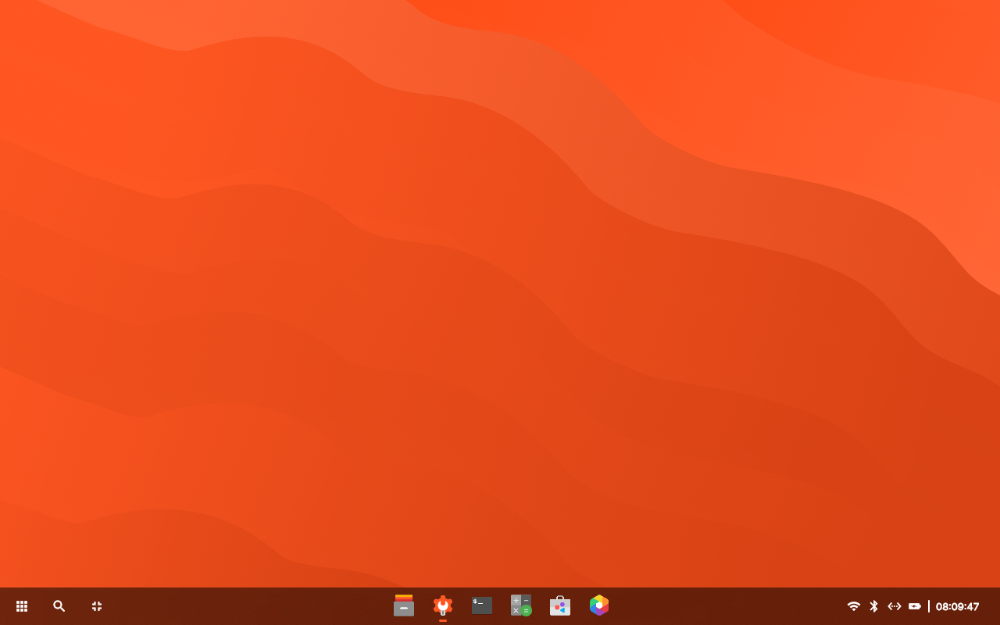
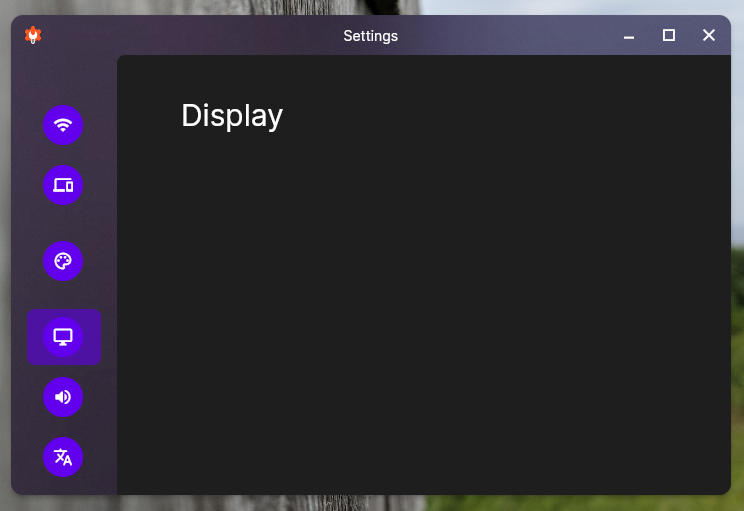
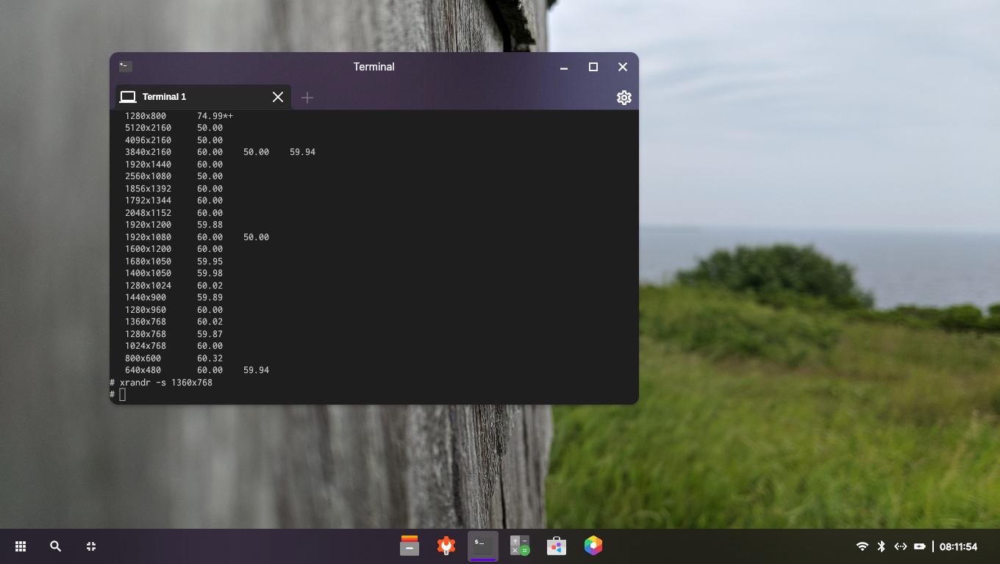

#  Пару слов про dahliaOS


dahliaOS — операционная система, основанная на FuchiaOS. Fuchia использует собственное микроядро Zircon и предназначена для встраиваемого оборудования. Но также существует и версия этой ОС, в основу которой положено ядро Linux. В обоих случаях в системе используется собственное рабочее окружение, основанное на фреймворке Flutter. Что это за система, в чём её смысл и как в ней вообще можно работать — добро пожаловать под кат.

Эта статья является продолжением цикла обзоров различных «экзотических» ОС. И пусть [первая статья](https://linuxoid85.github.io/UNIXTime/articles/os/serenity/) была посвящена операционке, разрабатываемой энтузиастами (что не совсем корректно по отношению к обозреваемой здесь dahliaOS), мне всё-таки захотелось рассказать о этой системе подробнее. Как всегда: краткий обзор интерфейса ОС, её особенности и всё остальное, что может заинтересовать потенциального пользователя.

## Полезные ссылки

Перед прочтением статьи можете посетить ряд сайтов для более точного понимания, что же такое эта ваша dahliaOS:

- [Сайт проекта](https://dahliaos.io/);
- [Попробовать запустить окружение Pangolin Desktop в браузере](https://web.dahliaos.io/) (**предупрждение: на моём компьютере работает медленно);
- [Организация на GitHub](https://github.com/dahliaOS);
- [Поддерживаемое оборудование](https://docs.dahliaos.io/running/supported-hardware);

## Получение ОС

Как я уже написал, эта ОС доступна в двух вариантах: на основе Fuchia и на основе Linux. Странное дело: на [странице загрузки](https://dahliaos.io/download) есть ссылки на образы Linux-based системы, но никак не на Fuchia-based. Интересно... Что ж, скачиваем Linux-based. Пусть на основе Linux'a не так интересно (кто этот Linux не видел? Ну кто? — Все же видели), но что поделаешь.

Интересно то, что страница загрузки разделена на две части: слева указан последний билд (датируется 23 февраля 2022 — старовата версия, однако ж!), справа — старые релизы, последний из которых выпущен ещё в декабре 2020. Интересно то, что образы системы подготовлены как для EFI, так и для BIOS. Обычно в Linux есть «комбинированные» образы, которые могут загружаться как в Legacy (BIOS), так и в UEFI, но тут то-ли разработчики не осилили сделать такой образ, то-ли так было сделано специально.

Если вы выбрали загрузку последнего (latest) билда ОС, скачается у вас zip-архив размером 437 МБ. Пугаться не следует, поскольку в этом архиве расположен загрузочный iso-образ размером 459,3 МБ. Что ж, приступим к записи образа на флешку.

### Системные требования

Отдельно хочется упомянуть [системные требования](https://docs.dahliaos.io/running/x86_64#requirements) этого всего извращения. dahliaOS требует 4 Гб оперативной памяти и 64-битный 4-ядерный процессор с видеоядром. Что касается обладателей недо-видеокарт от NVIDIA, то здесь облом: на сайте предупреждается о том, что графика от зелёных работать не будет, так что нужно использовать встройку.

## Запуск ОС

Я попытался запустить эту систему на своём нетбуке Samsung NF-210. Попытку запуска этой чудо-системы на этом железе можно назвать двумя словами: «я пытался». В действительности же сама система запускалась с флешки (USB 2.0) довольно долго, но так и не смогу запуститься: упала в Kernel Panic. Дело в том, что там жёстко установлен минимальный объём ОЗУ, и если объём установленной в компьютере оперативной памяти меньше минимально допустимого, то система просто не запустится.

<details>
  <summary><b>Почему запускал именно на этом ноутбуке?</b></summary>
  <p>Да, у меня есть основной ноутбук Samsung NF300E5C, удовлетворяющий системным требованиям. Но я не хочу на нём запускать вообще ничего — там есть некоторые проблемы с оборудованием, из-за которых тот же самый Linux работает не очень стабильно, а без изменения ряда параметров ядра система может вообще не запуститься, зависнув на этапе запуска рабочего окружения. Кроме того, на нём как раз я и пишу эту статью, поэтому не хотел отвлекать себя от процесса её написания.</p>
</details>


В системе такого уровня я планировал увидеть хоть какой-нибудь boot-splash (загрузочную анимацию) по типу того же самого Plymouth. Но, видимо, не судьба.


А вот и паника ядра!

Что-ж, придётся запускать в QEMU:

```bash
qemu-system-x86_64 -cdrom dahliaOS_220222_legacy.iso -m 2048 -enable-kvm
```

Что интересно: в системных требованиях указано, что системе нужно 4 Гб оперативной памяти, а в той же самой документации, но на странице [запуска ОС в QEMU](https://docs.dahliaos.io/running/qemu#download-and-run-dahliaos-with-qemu) пишут, что будет достаточно и двух Гб ОЗУ.

Что ж, похоже, на 2 Гб ОЗУ система действительно пытается загрузиться:



Система запускалась около двух минут. И теперь нас встречает такой вот красивенький интерфейс рабочего окружения Pangolin Desktop:



Я попытался изменить разрешение экрана, но заядя в настройки обнаружил заглушки на месте многих страниц:



Видимо, разрешение придётся менять через терминал:

```bash
xrandr -s 1360x768
```


