#  Пару слов про dahliaOS

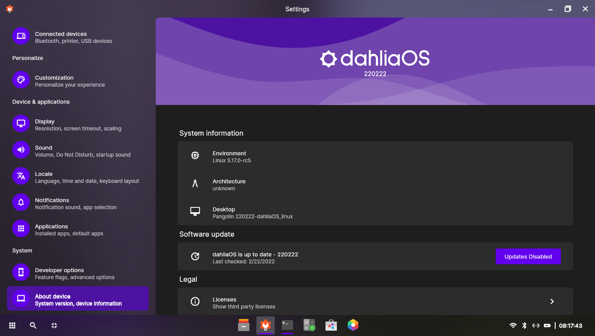

dahliaOS — операционная система, основанная на FuchiaOS. Fuchia использует собственное микроядро Zircon и предназначена для встраиваемого оборудования. Но также существует и версия этой ОС, в основу которой положено ядро Linux. В обоих случаях в системе используется собственное рабочее окружение, основанное на фреймворке Flutter. Что это за система, в чём её смысл и как в ней вообще можно работать — добро пожаловать под кат.

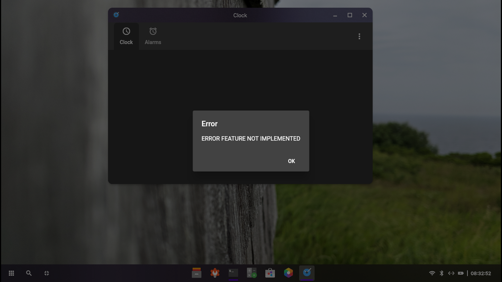

<small>Описание dahliaOS в одном скриншоте.</small>

Эта статья является продолжением цикла обзоров различных «экзотических» ОС. И пусть [первая статья](https://linuxoid85.github.io/UNIXTime/articles/os/serenity/) была посвящена операционке, разрабатываемой энтузиастами (что не совсем корректно по отношению к обозреваемой здесь dahliaOS), мне всё-таки захотелось рассказать о этой системе подробнее. Как всегда: краткий обзор интерфейса ОС, её особенности и всё остальное, что может заинтересовать потенциального пользователя.

## Полезные ссылки

Перед прочтением статьи можете посетить ряд сайтов для более точного понимания, что же такое эта ваша dahliaOS:

- [Сайт проекта](https://dahliaos.io/);
- [Попробовать запустить окружение Pangolin Desktop в браузере](https://web.dahliaos.io/) (**предупрждение:** там не работает практически ничего);
- [Организация на GitHub](https://github.com/dahliaOS) (чо-та пилят они, чо-та пилят, а последний релиз системы датируется 2022 годом);
- [Поддерживаемое оборудование](https://docs.dahliaos.io/running/supported-hardware);

## Получение ОС

Как я уже написал, эта ОС доступна в двух вариантах: на основе Fuchia и на основе Linux. Странное дело: на [странице загрузки](https://dahliaos.io/download) есть ссылки на образы Linux-based системы, но никак не на Fuchia-based. Интересно... Что ж, скачиваем Linux-based. Пусть на основе Linux'a не так интересно (кто этот Linux не видел? Ну кто? — Все же видели), но что поделаешь.

Интересно то, что страница загрузки разделена на две части: слева указан последний билд (датируется 23 февраля 2022 — старовата версия, однако ж!), справа — старые релизы, последний из которых выпущен ещё в декабре 2020. Интересно то, что образы системы подготовлены как для EFI, так и для BIOS. Обычно в Linux есть «комбинированные» образы, которые могут загружаться как в Legacy (BIOS), так и в UEFI, но тут то-ли разработчики не осилили сделать такой образ, то-ли так было сделано специально.

Если вы выбрали загрузку последнего (latest) билда ОС, скачается у вас zip-архив размером 437 МБ. Пугаться не следует, поскольку в этом архиве расположен загрузочный iso-образ размером 459,3 МБ. Что ж, приступим к записи образа на флешку.

### Системные требования

Отдельно хочется упомянуть [системные требования](https://docs.dahliaos.io/running/x86_64#requirements) этого всего извращения. dahliaOS требует 4 Гб оперативной памяти и 64-битный 4-ядерный процессор с видеоядром. Что касается обладателей недо-видеокарт от NVIDIA, то здесь облом: на сайте предупреждается о том, что графика от зелёных работать не будет, так что нужно использовать встройку.

На практике же оказалось, что оперативной памяти будет достаточно и 2 Гб.

## Запуск ОС

Я попытался запустить эту систему на своём нетбуке Samsung NF-210. Попытку запуска этой чудо-системы на этом железе можно назвать двумя словами: «я пытался». В действительности же сама система запускалась с флешки (USB 2.0) довольно долго, но так и не смогу запуститься: упала в Kernel Panic. Дело в том, что там жёстко установлен минимальный объём ОЗУ, и если объём установленной в компьютере оперативной памяти меньше минимально допустимого, то система просто не запустится.

<details>
  <summary><b>Почему запускал именно на этом ноутбуке?</b></summary>
  <p>Да, у меня есть основной ноутбук Samsung NF300E5C, удовлетворяющий системным требованиям. Но я не хочу на нём запускать вообще ничего — там есть некоторые проблемы с оборудованием, из-за которых тот же самый Linux работает не очень стабильно, а без изменения ряда параметров ядра система может вообще не запуститься, зависнув на этапе запуска рабочего окружения. Кроме того, на нём как раз я и пишу эту статью, поэтому не хотел отвлекать себя от процесса её написания.</p>
</details>

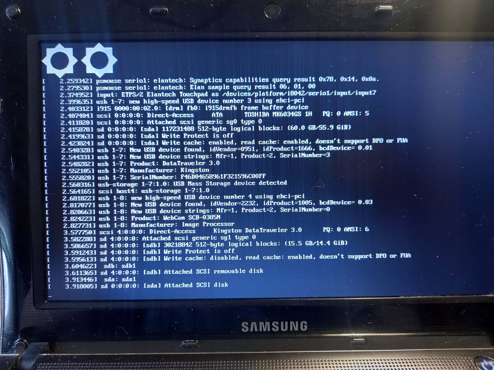

В системе такого уровня я планировал увидеть хоть какой-нибудь boot-splash (загрузочную анимацию) по типу того же самого Plymouth. Но, видимо, не судьба.

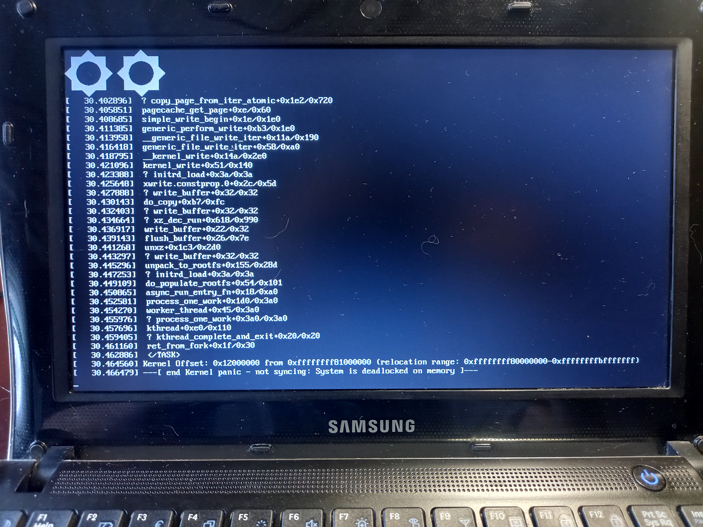

А вот и паника ядра!

Что-ж, придётся запускать в QEMU:

```bash
qemu-system-x86_64 -cdrom dahliaOS_220222_legacy.iso -m 2048 -enable-kvm
```

Что интересно: в системных требованиях указано, что системе нужно 4 Гб оперативной памяти, а в той же самой документации, но на странице [запуска ОС в QEMU](https://docs.dahliaos.io/running/qemu#download-and-run-dahliaos-with-qemu) пишут, что будет достаточно и двух Гб ОЗУ.

Что ж, похоже, на 2 Гб ОЗУ система действительно пытается загрузиться:


Система запускалась около двух минут. И теперь нас встречает такой вот красивенький интерфейс рабочего окружения Pangolin Desktop:


Я попытался изменить разрешение экрана, но зайдя в настройки обнаружил заглушки на месте многих страниц:


Видимо, разрешение придётся менять через терминал:

```bash
xrandr -s 1360x768
```


## Обзор интерфейса

Ну что ж, раз уж эта система запустилась, то давайте пробежимся по её графическому интерфейсу.

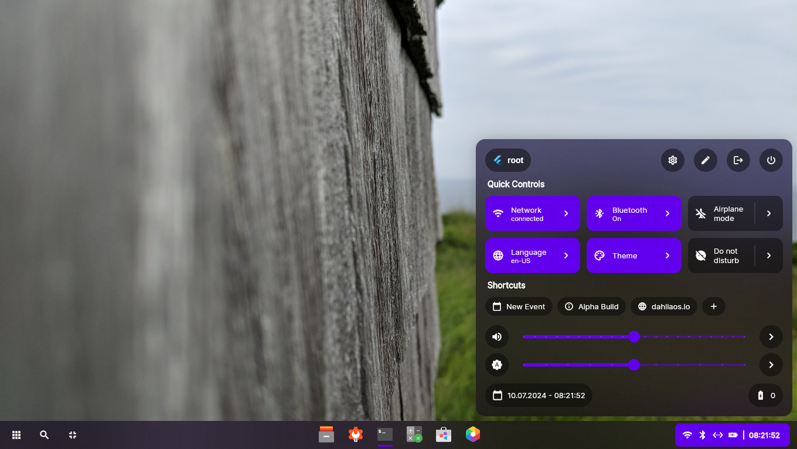

Панель вполне стандартная: слева находится кнопка входа в главное меню, кнопка поиска и кнопка для переключения рабочих столов (что-то вроде режима «Обзор» в GNOME или KDE). Посередине список открытых окон, а справа панель уведомлений, часы и меню с «Быстрыми настройками» (Quick Controls), содержащими настройки WiFi, Bluetooth, громкости и яркости, а также кнопки для управления текущим сеансом.

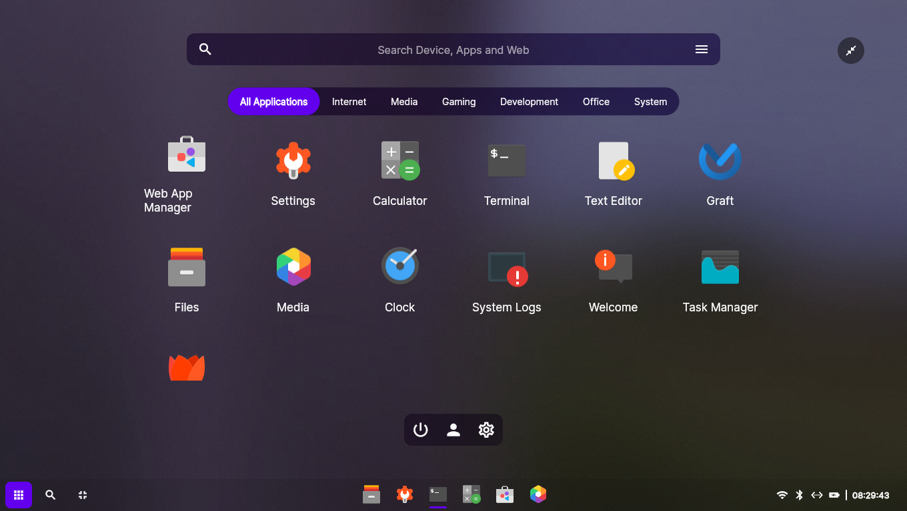

Главное меню, как и подобает многим современным ОС, разворачивается на весь экран. Список приложений здесь разделён на категории: Интернет, Медиа, Игры, Разработка, Офис и Системные. При желании главное меню можно «свернуть» в обычное, тогда у нас пропадает разделение приложений на категории, а также под именем программы отображается её краткое описание:

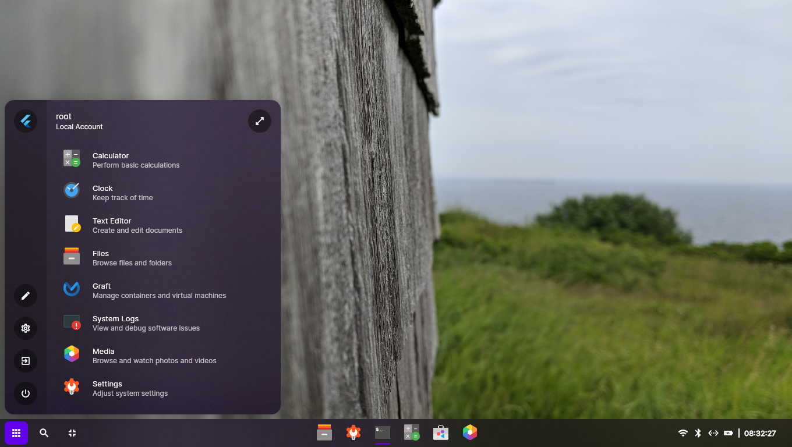

Мне не совсем понятно назначение кнопок управления сеансом в главном меню, поскольку они также есть и в меню быстрых настроек. Вообще, касаемо интерфейса, возникает очень много вопросов: ведь сама ОС развивается (а развивается ли уже?) несколько лет, но особого прогресса нет. Что и говорить, если здесь не работают многие приложения, а те, которые имеют хоть какой-то функционал кроме отображения красивого GUI, недопилены и не обладают даже самыми базовыми вещами, которые есть даже в менее крупных ОС (по типу той же [SerenityOS](https://linuxoid85.github.io/UNIXTime/articles/os/serenity/)).

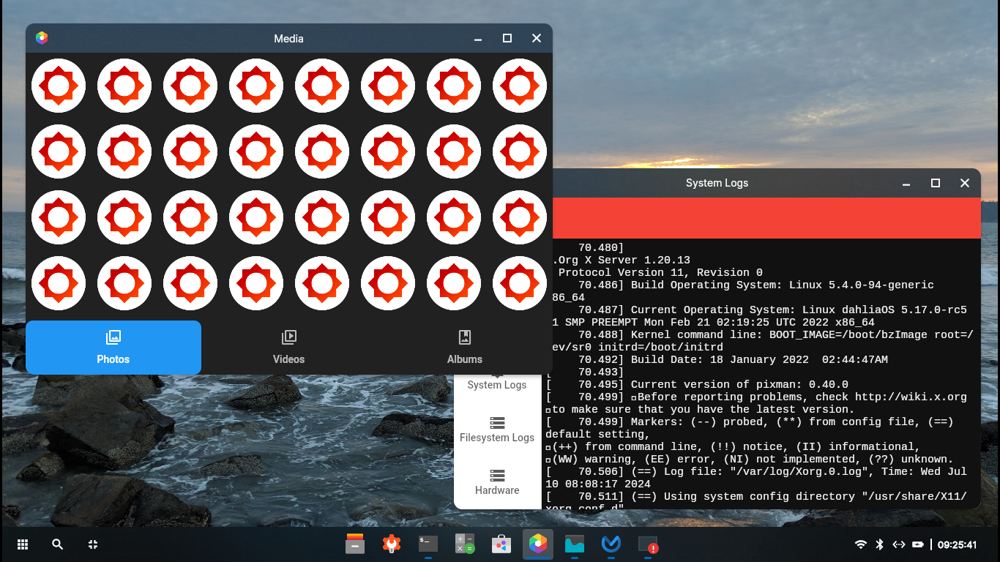

На скриншоте выше открыто приложение «Media», которое, как я понял, должно являться заменой приложениям «Галерея» и «Видео» из Android. Т.е. та программа, которая как бы собирает в себе все медиафайлы для удобного к ним доступа. Что мы видим здесь? А здесь мы видим очередную заглушку, которая не отображает ничего, кроме логотипов этой ОС. И да — здесь используется X.org. Ну почему бы не использовать Wayland? Все современные (и не очень — Xfce и MATE на очереди) DE переходят или уже перешли на использование этого протокола вместо ужасной окаменелой продукции жизнедеятельности стада мамонтов.

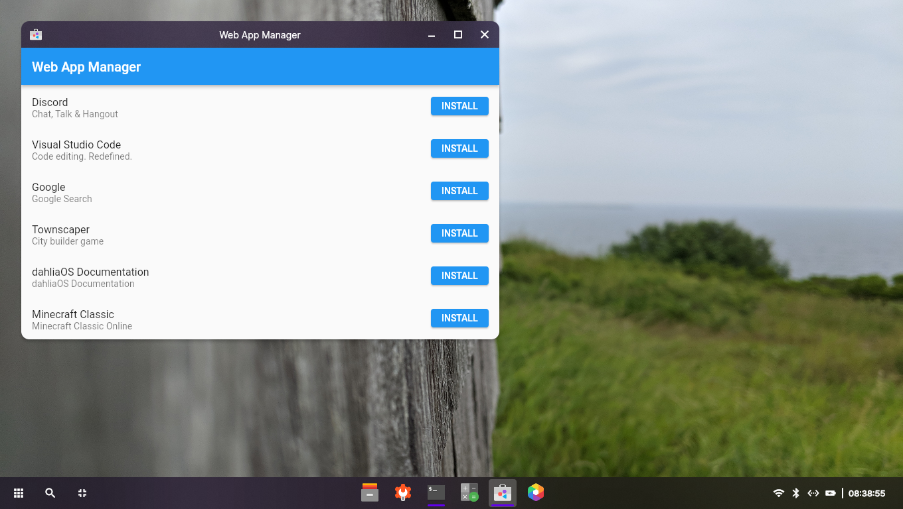

Судя по наличию Web App Manager, эта система задумывалась как некая замена ChromeOS. Но у них это явно не получилось. Потому что Web App Manager — очередная заглушка, содержащая несколько случайно выбранных программ, которые мы не можем установить — кнопка «Install» не делает ровным счётом ничего.

Очень «занятная» вещь: когда нажимаешь комбинацию <kbd>Alt</kbd>+<kbd>F4</kbd>, у нас не закрывается текущее окно, а происходит что-то... Что-то странное: у нас вообще всё закрывается и показывается логотип ОС:

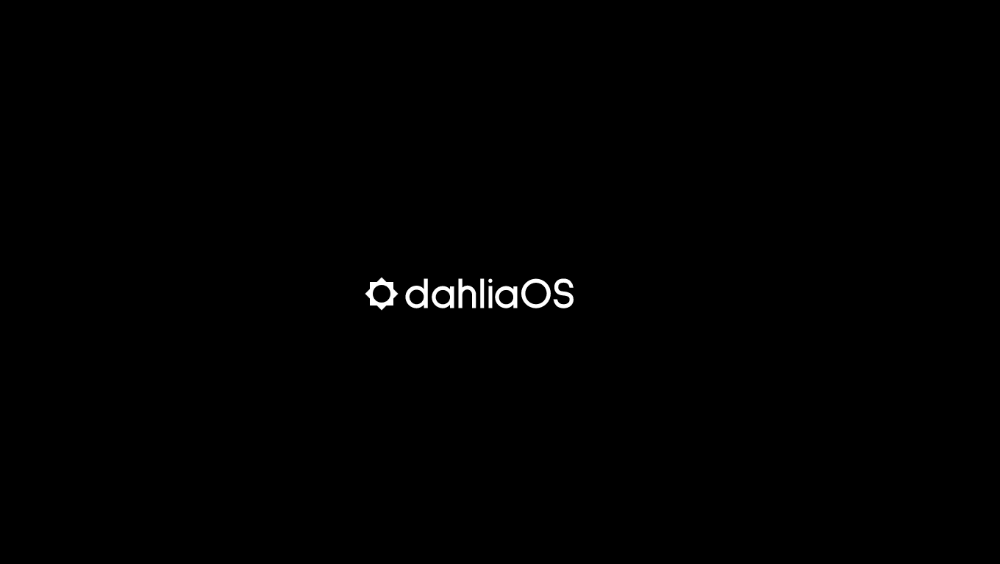

Более ничего не происходит и ОС не реагирует ни на какие комбинации клавиш.

Вообще, используя эту ОС, меня не покидало ощущение, будто это не ОС вовсе, а какая-то демка или макет интерфейса. Здесь не работает буквально **всё**. Например, поиск ничего кроме приложений не ищет, хотя заявлено «Search Device, Apps and Web»:

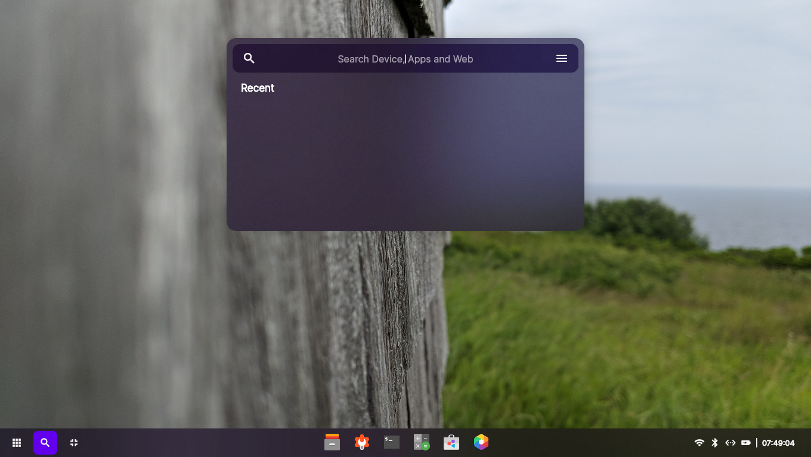

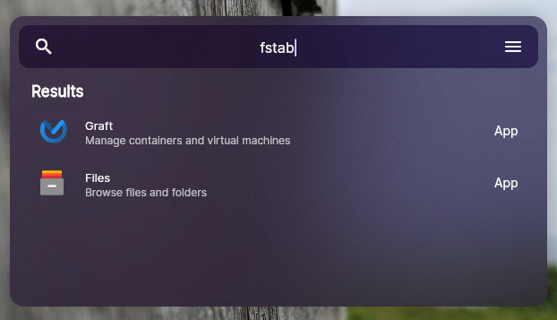 | 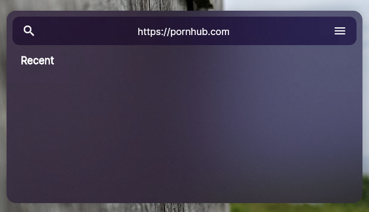

Переключалка рабочих столов тоже не работает:

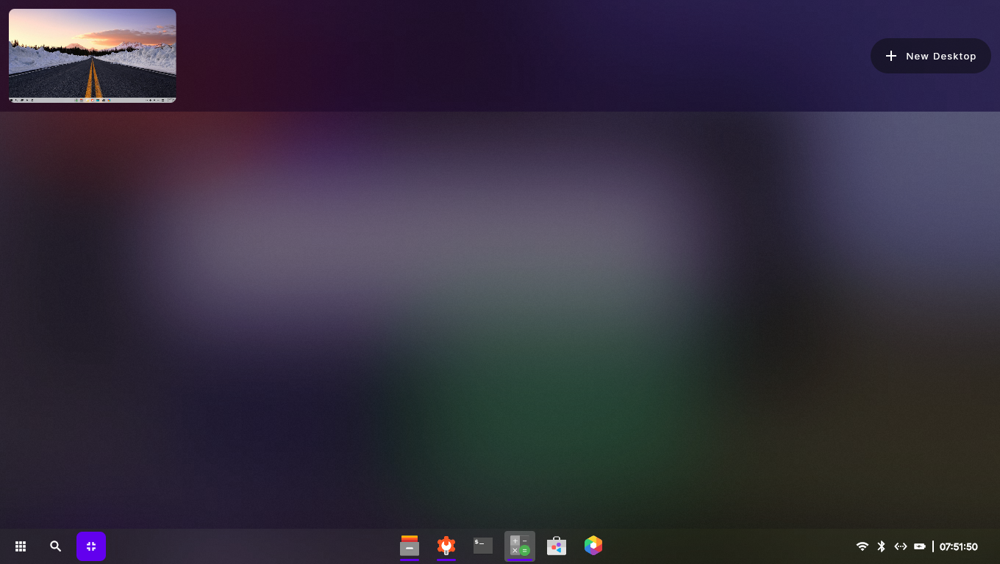

Экран переключения рабочих столов разделён на две части. В верхней содержится список этих рабочих столов, а в нижней, по всей видимости, должны быть миниатюры открытых окон. Как в KDE или GNOME:

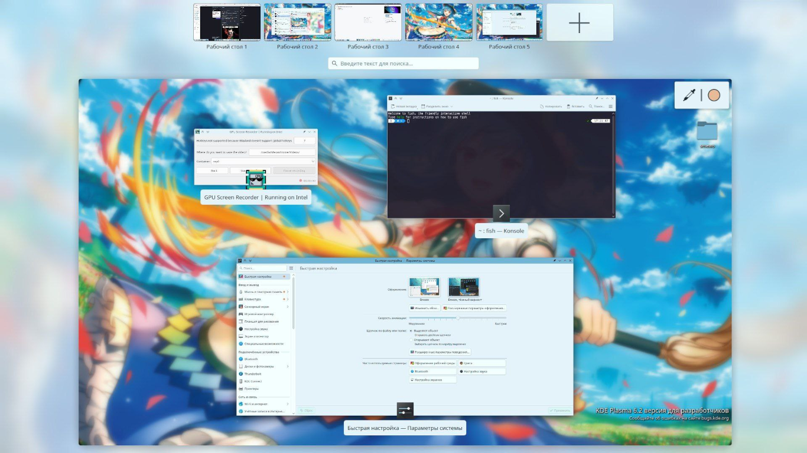 | 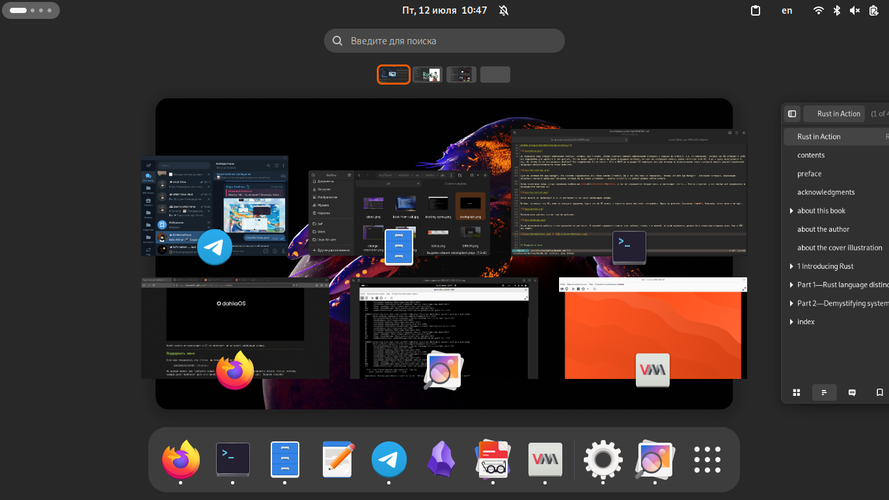

Мало того, что переключатель рабочих столов в dahliaOS не умеет отображать миниатюры открытых окон и создавать новые рабочие столы (хотя кнопка «+ New Desktop» присутствует), так в единственном отображающемся в этом экране рабочий стол отображается неправильно! Здесь должна быть *миниатюра* этого рабочего стола, но отображается какая-то левая картинка, не имеющая ничего общего с текущим рабстолом. Как минимум из-за того, что у меня стоят совершенно другие обои, а не то, что в этом переключателе.

---

## Поддержать меня

Если вам понравилась эта статья, вы можете отправить мне донат:

> **2202206252335406** (Сбербанк)

На данный момент мне требуется новый ноутбук, на котором я смогу продолжить писать статьи, поэтому каждый донат приблизит дату его приобретения на какой-то небольшой срок. Заранее спасибо!
