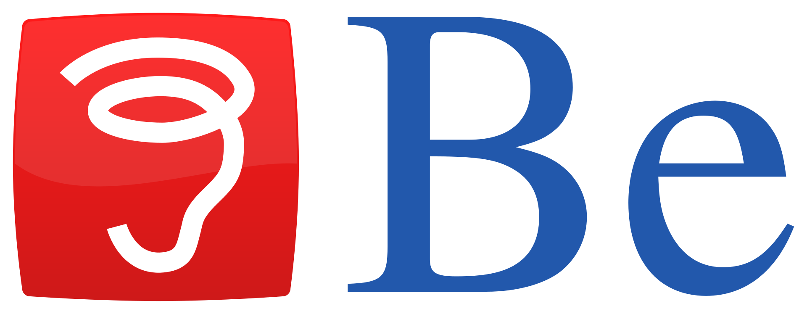
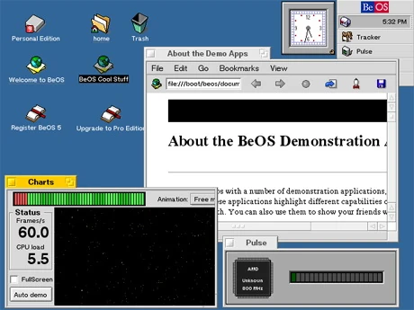
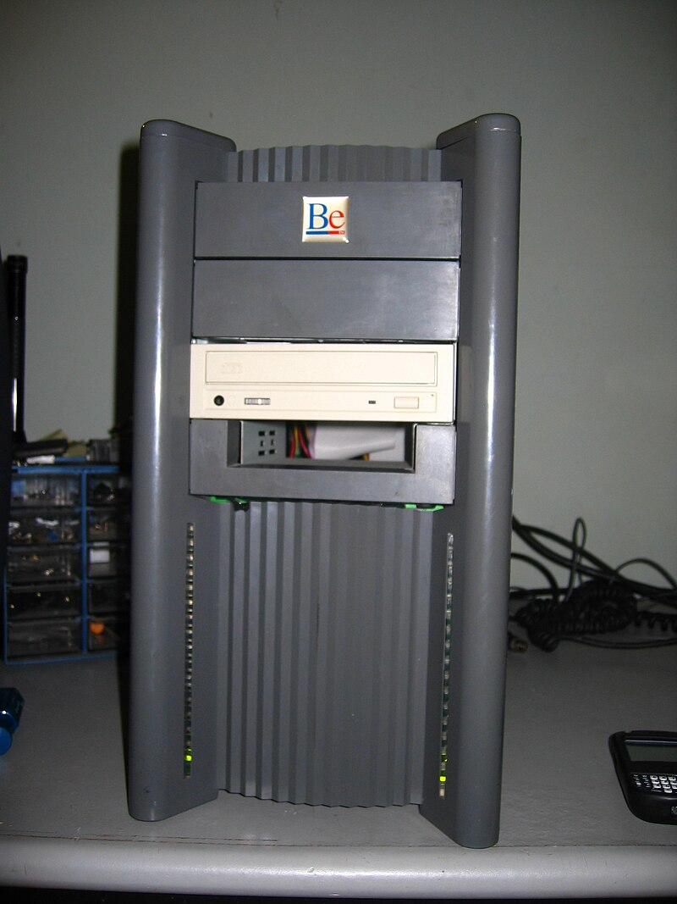
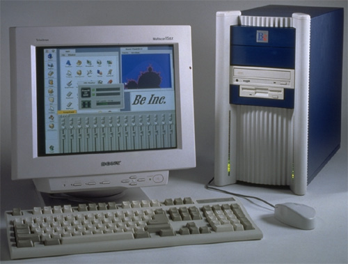
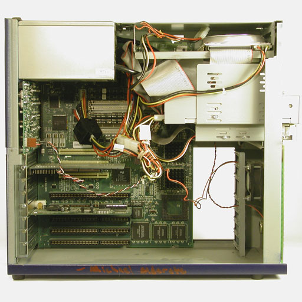
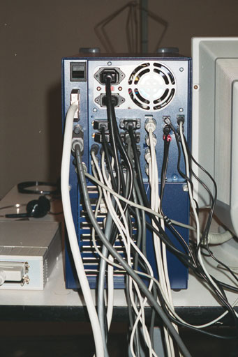
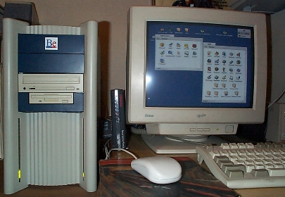
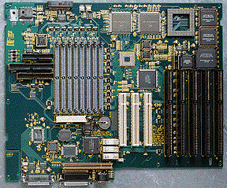
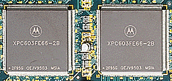
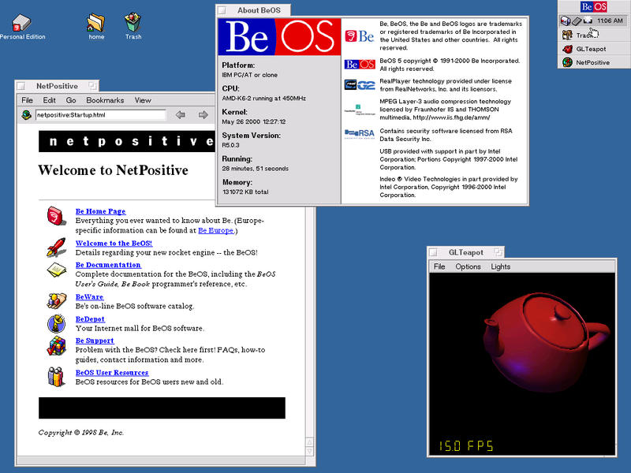

# Пару слов про Haiku. Часть 1 — Введение

Haiku — очередная операционная система, которая обозревается на этом сайте. Впервые на свой компьютер (Samsung NF210) я поставил её ещё год назад, и сразу же она мне понравилась, несмотря на то, что у неё присутствовали проблемы с поддержкой части железок этого ноута. Забегая вперёд отмечу, что среди всех «альтернативных» операционных систем, которые я использовал, Haiku является самой зрелой, развитой и пригодной к повседневному использованию. У неё есть своё сообщество как разработчиков, так и пользователей. Что и говорить: эта ОС имеет свою фан-базу в том числе и в России ([группа ВКонтакте](https://vk.com/haiku_os), [чат в Telegram](https://t.me/Haiku_RUS)).

Haiku, в отличие от двух предыдущих обзирантов, появилась не на пустом месте. Поэтому в первой статье из цикла про Haiku я напишу про историю её возникновения.

<!--
- Что такое BeOS;
- Поиск себя: BeBox, PowerPC, Intel
- Причины провала BeOS
- И тут мы плавно подходим к Haiku...
-->

## Полезные ссылки

Перед тем, как продолжить, рекомендую посетить ряд сайтов для более точного понимания того, что же такое Haiku:

- [BeBox zone — музей BeOS](https://web.archive.org/web/20070728103610/http://bebox.nu/);
- [Сайт Be Incorporated](https://web.archive.org/web/20031128123907/http://www.beincorporated.com/) (webarchive);
- [Сайт операционной системы Haiku](https://www.haiku-os.org/);
- [Русскоязычное Haiku OS WiKi](https://haiku-os.fandom.com/ru/wiki/HaikuOS_-_%D0%A0%D1%83%D1%81%D1%81%D0%BA%D0%BE%D1%8F%D0%B7%D1%8B%D1%87%D0%BD%D0%B0%D1%8F_%D0%92%D0%B8%D0%BA%D0%B8);
- [Цикл статей про Haiku от создателя AppImage](https://habr.com/ru/companies/slurm/articles/461141/);

## Be Inc.

Всё началось с создания в 1990 году Be Incorporated. Она была создана бывшим исполнительным директором Apple, поэтому совсем не удивительно, что одной из целей новой корпорации было создание компьютерной системы нового поколения. У сотрудников Be Inc. была цель создать простой, надёжный и *современный* компьютер (именно компьютер, не что-то иное!), а создание операционной системы было второстепенной побочной целью. Но уже с самого начала в будущей операционной системе планировали активно использовать *атрибуты* — специальную информацию о файле, записанную не в самом файле. Впоследствии и BeOS, и её потомок Haiku стали использовать файловую систему BeFS, активно полагающуюся на атрибуты файлов. Но это уже другая история.

<small>Скриншот операционной версии BeOS 5 — это последняя версия операционки.</small>

Итогом деятельности Be Inc. стал компьютер BeBox, вышедший в октябре 1995 года. И в том же году вышла первая версия BeOS, способной запускаться на этом компьютере.

 | 

<small>На передней панели этого компьютера мы видим две вертикальных полосы светодиодов. Они использовались в качестве индикатора нагрузки на каждый из <b>двух</b> процессоров. Кроме того, нижний светодиод (на правой полоске) указывал на активность жёсткого диска. Вполне себе неплохой маркетинговый ход, особенно учитывая то, что многопроцессорность была отличительной чертой BeBox.</small>

 |  |  | 

<small>Фотографии были взяты <a href="http://www.josephpalmer.com/BeBox/BeBox.shtml">отсюда</a> и <a href="https://web.archive.org/web/20071012170227/http://bebox.nu/images.php?s=images/ppcbebox">отсюда</a>.</small>

<small>Фото материнской платы BeBox. Взято <a href="https://web.archive.org/web/20071017122956/http://www.bebox.nu/tech.php?s=tech/mainprocboard">здесь</a>.</small>

Одной из главных киллер-фич этих компьютеров была *многопроцессорность* — вещь в то время достаточно необычная и нераспространённая. Кроме того, эти компьютеры неплохо подходили и для работы с графикой из-за подходящего для этого железа и относительно невысокой (например, по сравнению с Silicon Graphics) стоимости.

<small>На материнской плате устанавливалось два процессора PowerPC 603/603e. Они работали на частоте 66 или 133 МГц. Фото взято <a href="https://web.archive.org/web/20071017123259/http://www.bebox.nu/tech.php?s=tech/processors">тута</a>. Кстати, были также модели, оснащённые процессорами по 200 МГц, но для общества они никогда не были доступны.</small>

Компьютеры BeBox выпускались крайне недолго — с конца 1995 и до начала 1997 года, их тираж составил около 2000 экземпляров, после чего Be Inc. объявила о сворачивании производства вполне удачных и перспективных компьютеров.

Проблемы финансового плана, проблемы с выбором процессоров, которые будут устанавливаться в BeBox, а также почти полное отсутствие поддержки среди производителей ПО и оборудования и как итог крайне небольшое число программ и драйверов сделали своё дело. Идея BeBox не взлетела, даже несмотря на то, что сборщикам компьютеров предлагалась бесплатная лицензия на BeOS при установке её в качестве второй ОС.

### Ещё немного о BeOS

BeOS была написана с нуля и не несла багажа устаревших технологий, присутствовавших в уже имеющихся на тот момент ОС для обеспечения обратной совместимости с железом/ПО. Ключевыми особенностями этой ОС были:

- **Микроядерная архитектура**, в то время как другие ОС, как правило, были монолитными;
- **Вытесняющая многозадачность**;
- **SMP**, а значит поддержка многопоточности и увеличение производительности ОС;
- **Мультимедиа** — как компьютеры BeBox, так и ОС для них была ориентирована на работу с мультимедиа;
- **Файловая система BFS** с поддержкой атрибутов файлов, поддерживающая жёсткие диски объёмом до нескольких терабайт и с наличием журналирования;
- и т.д.

На одной из выставок в 1995 году BeBox с предустановленной BeOS произвёл фурор. Была подготовлена презентация, демонстрирующая одновременную обработку восьми AVI-видеофайлов и трёхмерной графики. Система демонстрировала производительность на уровне IBM RS/6000, которая стоила десятки тысяч $, в то время как BeBox стоил всего около двух тысяч долларов.

## Дальнейшее развитие

Производство компьютеров BeBox было свёрнуто, но операционка BeOS никуда не пропадала. Теперь ей потребовалась новая платформа. Вполне логичным выбором стали компьютеры Macintosh от Apple. На выборе сказалось то, что BeBox работали на PowerPC, и Macintosh тоже. К слову, портирование BeOS на Mac заняло всего два дня.

К тому времени дела у Apple шли не совсем хорошо, да и тогдашняя операционная система для Macintosh безнадёжно устарела, поэтому яблочная компания начала вести переговоры о покупке Be Inc. Операционная система с вытесняющей многозадачностью и защищённым режимом памятит — вот что нужно было Apple. Но переговоры провалились и BeOS так и не пришла на Mac. Она могла запускаться лишь на некоторых моделях яблочных компьютерах, но на этом всё.

 | 

В итоге BeOS была перенесена на привычные всем процессоры Intel и, начиная с версии BeOS 3, эту операционку можно запустить и на обычных IBM PC. Казалось бы, сейчас BeOS начнёт набирать ещё бОльшую популярность, но и тут возникли проблемы.

Во-первых, это наличие двух редакций BeOS — Personal (бесплатная версия) и Professional Edition. Проблема заключалась в том, что состав бесплатной версии почти полностью дублировал профессиональную и продажи последней неуклонно падали.

Во-вторых, свою роль в «смерти» BeOS сыграла и наша любимая Microsoft, надавившая на производителей ПК, которые в итоге отказались от предустановки этой ОС на свои компьютеры в пользу Windows. Конечно, в 2003 году MS всё-таки выплатила Be Inc. определённую мзду за нарушение антимонопольного законодательства, но последняя ещё год назад была объявлена банкротом и выплаченные ей деньги никак её не спасли...

## И тут мы плавно подходим к Haiku...

Дальнейшее развитие BeOS нас не так интересует, поскольку в 2002 году выходит операционная система Haiku, ставящая своей целью быть двоично-совместимой с последней пятой версией почившей BeOS, а спустя год была создана некоммерческая организация Haiku Inc., которая занимается организационными вопросами в проекте. О новой операционной системе оговорим в следующей статье.

## Подытожим

BeOS, ровно как и другая продукция Be Inc., была в своё время передовым решением. Однако она всё равно не смогла набрать достаточного количества пользователей и программного обеспечения, чтобы оказать конкуренцию двум тогдашним гигантам: Windows и MacOS. Каковы причины этого? Во-первых, сорванные переговоры о покупке Be Inc. корпорацией Apple. Если бы не это, то вместо современной macOS, основанной на NEXTStep, мы бы видели что-то иное, основанное на наработках BeOS. Во-вторых, деятельность корпорации Microsoft, которая не могла смириться с конкуренцией Windows и BeOS на IBM PC-совместимых компьютерах.

Есть некоторые причины в прекращении производства BeBox и финансовые проблемы самой компании Be, но это уже [совсем другая история](https://web.archive.org/web/20071020021306/http://bebox.nu/history.php?s=history/1996).

## Благодарности

При написании этой статьи были использованы материалы с сайта [https://haiku-os.fandom.com](https://haiku-os.fandom.com/ru/wiki/BeOS).

---

## Поддержать меня

Если вы хотите отблагодарить меня за проделанную работу, можете отправить мне донат на карту:

> **2202206252335406** (Сбербанк)

Донаты показывают мне, что статьи, которые я пишу, востребованы у читателей, а также поднимают мне мотивацию и бодрость духа.

На данный момент мне требуется новый ноутбук, на котором я смогу продолжить писать статьи, поэтому каждый донат приблизит дату его приобретения на какой-то небольшой срок. Заранее спасибо!
