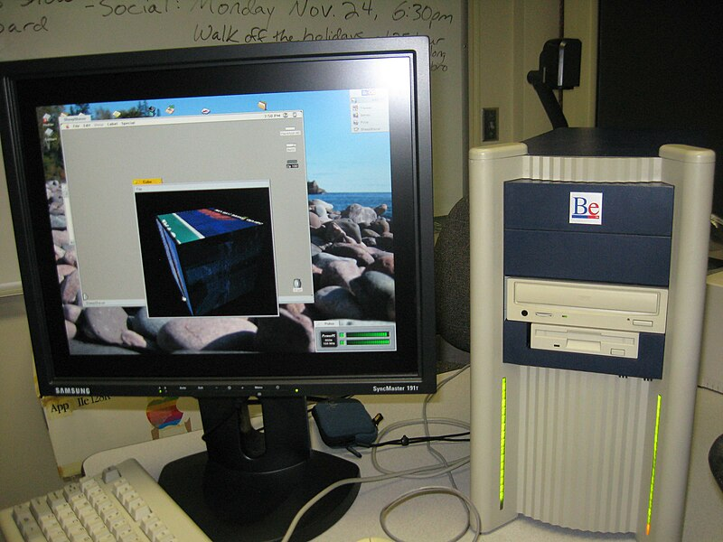

# Пару слов про Haiku. Часть 1 — Введение

Haiku — очередная операционная система, которая обозревается на этом сайте. Впервые на свой компьютер (Samsung NF210) я поставил её ещё год назад, и сразу же она мне понравилась, несмотря на то, что у неё присутствовали проблемы с поддержкой части железок этого ноута. Забегая вперёд отмечу, что среди всех «альтернативных» операционных систем, которые я использовал, Haiku является самой зрелой, развитой и пригодной к повседневному использованию. У неё есть своё сообщество как разработчиков, так и пользователей. Что и говорить: эта ОС имеет свою фан-базу в том числе и в России ([группа ВКонтакте](https://vk.com/haiku_os), [чат в Telegram](https://t.me/Haiku_RUS)).

Haiku, в отличие от двух предыдущих обзирантов, появилась не на пустом месте. Поэтому в первой статье из цикла про Haiku я напишу про историю её возникновения.

<!--
- Что такое BeOS;
- Поиск себя: BeBox, PowerPC, Intel
- Причины провала BeOS
- И тут мы плавно подходим к Haiku...
-->

## Be Inc.

Всё началось с создания в 1990 году Be Incorporated. Она была создана бывшим исполнительным директором Apple, поэтому совсем не удивительно, что одной из целей новой корпорации было создание компьютерной системы нового поколения. У сотрудников Be Inc. была цель создать простой, надёжный и *современный* компьютер (именно компьютер, не что-то иное!), а создание операционной системы было второстепенной побочной целью. Но уже с самого начала в будущей операционной системе планировали активно использовать *атрибуты* — специальную информацию о файле, записанную не в самом файле. Впоследствии и BeOS, и её потомок Haiku стали использовать файловую систему BeFS, активно полагающуюся на атрибуты файлов. Но это уже другая история.

Итогом деятельности Be Inc. стал компьютер BeBox, вышедший в октябре 1995 года. И в том же году вышла первая версия BeOS, способной запускаться на этом компьютере.

 | 
