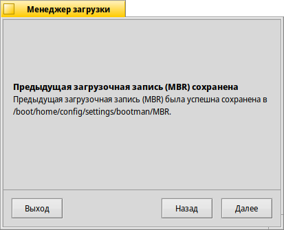

# Пару слов про Haiku. Часть 2 — Что такое Haiku?

## Причины создания ОС

В [первой](../1/) части рассмотрели историю возникновения Haiku. Говоря простыми словами — компания Be Inc. прекратила своё существование, а вместе с ней отошла в мир иной и разрабатываемая ими BeOS. В начале двухтысячных Был создан проект OpenBeOS, который спустя какое-то время был переименован в Haiku. Главной целью нового любительского проекта стало создание операционной системы, бинарно совместимой с почившей BeOS.

В этой же статье рассмотрим установку Haiku на компьютер, основные проблемы с железом и принцип работы с её графическим интерфейсом.

## Системные компоненты

Ядро Haiku было написано бывшим инженером Be Inc. и полностью совместимо с программным обеспечением BeOS R5. Оно имеет гибридную структуру.

Из проекта openSUSE используется библиотека `libsolv` для обработки зависимостей пакетов ПО. Каждый пакет содержится в файле `*.hpkg`, который является образом файловой системы `packagefs`. Эти образы монтируются в режиме «Только чтение». Для управления пакетами может применяться программа «HaikuDepot».

В графическом интерфейсе есть два основных компонента: Deskbar и Tracker. Первый отображает что-то вроде панели задач из Windows (т.е. предназначен для управления окнами, доступа в главное меню и области уведомлений), второй же является файловым менеджером. Существует технология *репликантов* — автономных частей ПО, которые мы можем «перетащить»» на рабочий стол. Что-то вроде гаджетов Windows 7 или виджетов из Plasma, но круче.

## Получение ОС

В отличие от первой обозреваемой мной ОС, Haiku делают загрузочные iso-образы для архитектур x86 и x86_64. Текущую на момент написания статьи версию Haiku R1 Beta 4 можно скачать [отсюда](https://www.haiku-os.org/get-haiku/r1beta4/). Далее образ пригоден к записи с помощью `dd`, [Impression](https://flathub.org/ru/apps/io.gitlab.adhami3310.Impression), Etcher, Rufus, etc...

## На чём будем запускать?

Эту ОС я запущу на моём нетбуке Samsung NF210. Он оснащён 1 Гб ОЗУ DDR3, процессором Intel Atom N455, работающим на частоте 1.66 ГГц, а также жёстким диском на 60 Гб.

 | 

## Первая загрузка

Система загружается, сразу же показывая красивую заставку (к слову, в Linux «бесшовно»,т.е. не переключаясь периодически на текстовую консоль после запуска ядра и перед запуском рабочего окружения, отображать BootLogo научились только недавно, и то не везде). И сразу же после заставки запускается приветственное окно с выбором языка системы. Никаких текстовых консолей (TTY), всё слажено, монолитно и *графически*.

Нет никаких сообщений ядра и системы инициализации, нет ощущения, что GUI приклеен к остальной системе на низкокачественный двусторонний скотч. В отличие от Linux и ряда других ОС семейства Unix, здесь ядро, остальная система и GUI идеально свазаны друг с другом!

Сама же система на данный момент создана только для одного пользователя. Красиво? Очень. У нас *персональный* компьюьтер, поэтому зачем нам тысячу пользователей в системе? Лично я бы сделал разделение: «суперпользователь» и «обычный пользователь», плюс какие-то системные пользователи, скрытые от обычного. В большинстве случаев этого бы вполне хватило. Концепция 100500 юзеров избыточна.

Что ж, система загрузилась. И первое, что она сделала, это отобразило окно с выбором языка. Выбираю родной великий и могучий, после чего нажимаю «Try Haiku». И сразу же показывается рабочий стол с иконками и Deskbar — некоим аналогом панели задач в Windows. Внешний вид у него немного другой, но логика работы с ним та же самая: тут тебе и главное меню (кстати, оно вызывается не клавишей Super с изображением логотипа Windows, а клавишей для вызова контекстного меню — не на каждой клавиатуре её уже встретишь), и панель уведомлений, и список открытых окон.

Кстати, вы могли заметить, что в списке открытых окон всегда «висит» программа Tracker. Tracker — это файловый менеджер. Как и обычно (тоже самое и в Windows, и в macOS, и в некоторых DE для Linux) файловый менеджер не только предоставляет функции для навигации по ФС и работы с файлами, но ещё и управляет поведением рабочего стола, рисуя на нём иконки и позволяя с ними работать. Поскольку рабочий стол у вас постоянно запущен, в списке открытых окон постоянно висит Tracker. Для пользователей, скажем, macOS это не будет чем-то неожиданным, поскольку и у них так же в доке всегда отображается открытый Finder...

## Установка ОС

### Разметка диска

Для начала нам нужно разметить диск, на который установим Haiku. Для этого заходим в «Меню» -> «Applications» -> «Разметка диска». Интерфейс этой программы будет знаком тем, кто хоть раз в жизни работал с GParted или GNOME Disks, поэтому пояснять его я не буду.

Нам нужно создать на жёстком диске раздел Be File System, на котором будет установлена наша Haiku. Для этого создайте раздел (<kbd>Alt</kbd>+<kbd>C</kbd>), укажите его тип «Be File System» и нажмите кнопку «Создать»:

 | 

Теперь этот раздел вам нужно инициализировать (в терминологии Haiku это зто значит форматирование раздела). Нажмите правой кнопкой по созданному разделу и выберите «Инициализировать» -> «Be File System»:

 |  | 

Теперь можно закрыть окно программы для разметки дисков.

> **Обратите внимание!** Рекомендую ставить систему на диск с таблицей разделов MBR. Если у вас иная, то выберите в программе «Разметка дисков» нужный диск, далее вверху окна выберите меню «Диск» -> «Инициализировать» -> «Intel Partition Map».
>
> 

## Установка системы

Зайдите в меню -> «Applications» -> «Установщик». Будет открыто окно с предупреждением:

В открытом окне в выпадающем меню «На диск:» укажите только что созданный выше раздел, куда будет установлена Haiku:

В меню «Показать опциональные пакеты» можете выбрать дополнительное ПО, которое будет установлено в вашу ОС. Это ПО для разработки: компиляторы, системы сборки, какие-то библиотеки... Если всё это вам не нужно, то снимите галочки со всех пунктов, что там есть (по умолчанию установка всех опциональных пакетов включена):

Процесс установки довольно быстрый, поскольку бОльшая часть системы — это `*.hpkg`-файлы. После установки системы вам нужно будет установить загрузчик ОС (установщик не ставит его самостоятельно). Для этого в программе установщика запустите «Менеджер загрузки», зайдя в меню «Инструменты» -> «Установить загрузочное меню»:

Выберите в открывшемся окне жёсткий диск, куда следует установить загрузчик (т.е. тот диск, на который ставили Haiku) и нажмите «Установить».

Сохраните на всякий случай текущую загрузочную запись MBR — просто нажмите «Далее»:

 | 

Выберите раздел с Haiku, который будет присутствовать в загрузочном меню:

Далее укажите число секунд, которые загрузчик будет ожидать до тех пор, пока автоматически не выберет указанный по умолчанию пункт меню:

<small>Я обычно убираю этот ползунок влево до уровня «Без ожидания», поскольку ОС у меня на компьютере установлена одна и мне нет нужды иметь тайм-аут загрузчика.</small>

После этого можем закрыть все окна и перезагрузить ОС (меню -> «Завершение работы...» -> «Перезагрузить компьютер»).

## Заключение

После успешного окончания установки мы можем закрыть все окна и перезагрузить ОС (меню -> «Завершение работы...» -> «Перезагрузить компьютер»).

После перезагрузки я установил на рабочий стол несколько репликантов, поменял обои и чуть поднастроил Deskbar. Первое впечатление, особенности интерфейса, использование репликантов и прочее — в следующей статье.

---

## Поддержать меня

Перед тем, как продолжить чтение, вы можете отправить мне донат на карту:

> 2202206252335406 (Сбербанк)

Это позволит мне перестать пользоваться Samsung NF210 и купить ноутбук посовременнее. Может быть...
