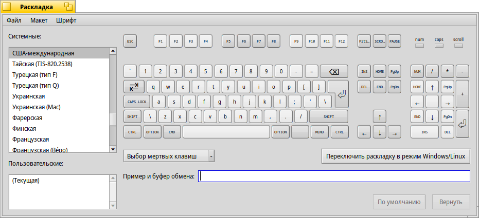

# Пару слов про Haiku. Часть 3 — Первый запуск ОС

Что-ж, во [второй](../2/) части мы установили Haiku на нетбук Samsung NF210, сейчас же пришло время рассмотреть эту ОС подробнее.

## Первый запуск

Система, установленная на старый HDD, работает вполне отзывчиво (достаточно шустро она работала и с загрузочного USB). К слову, если вы запишите iso-образ Haiku на флешку, то получите не ограниченную Live-систему (как в случае с Linux), а вполне пригодную к работе ОС. Это реальная система, в которой сохраняются все ваши изменения и настройки, чего нельзя сказать про «живые» образы Linux, где вся система содержится в squashfs-образе, недоступном для записи.

Система загружается достаточно быстро — на моём компьютере меньше минуты. Во время загрузки не отображаются текстовые сообщения ядра и системы инициализации, нет рваных переходов между загрузочной анимацией и графическим интерфейсом (когда во время этого перехода показывается текстовая консоль TTY). Сразу видно, что в отличие от Linux и BSD, в Haiku графический интерфейс и остальные системные компоненты не примотаны друг к другу на скотч, а идеально подогданы друг под друга, всё тесно взаимосвязано и интегрировано. Поскольку система создана для одного пользователя, то не отображается меню входа в систему, которое в Linux я всегда отключаю, устанавливая автоматический вход от имени одного единственного пользователя, которого я создал во время установки ОС.

Лично я считаю, что в современной десктопной ОС функционал для создания новых пользователей вообще должен быть крайне урезан. У нас есть пользователь `root` (на всякий случай, а вдруг у нас система сломается и придётся её восстанавливать — Linux не отличается особой стабильностью), есть несколько системных пользователей, и есть один единственный **обычный** пользователь, от имени которого и будут работать люди за компьютером. `root` и системные пользователи скрыты от глаз обычного юзера, потому что ему их видеть не следует. За всю свою жизнь я не видел ни одного человека, у которого на компьютере заведено несколько обычных пользователей, от имени которых люди работают за компьютером.

## Комбинации клавиш

Самым важным отличием Haiku от других систем является замна клавиш Alt и Ctrl местами. Например, если в современных ОС для переключения окон существует комбинация <kbd>Alt</kbd>+<kbd>Tab</kbd>, то здесь <kbd>Ctrl</kbd>+<kbd>Tab</kbd>.

К слову, клавиша <kbd>Super</kbd> (с логотипом Windows) здесь имеет название <kbd>Option</kbd>, а клавиша <kbd>Alt</kbd> в программе «Раскладка» (её скриншот выше) имеет название <kbd>Cmd</kbd>, хотя в остальных программах упоминается её привычное назание <kbd>Alt</kbd>.

Комбинация <kbd>Alt</kbd>+<kbd>F4</kbd> не закрывает окно, а переключает нас на четвёртый рабочий стол. Кстати, каждый рабочий стол может иметь свои обои.

Комбинация <kbd>Ctrl</kbd>+<kbd>Alt</kbd>+<kbd>Z</kbd> разворачивает окно до максимального размера, а <kbd>Ctrl</kbd>+<kbd>Alt</kbd>+<kbd>Shift</kbd>+<kbd>Z</kbd> разворачивает окно на весь экран, закрывая собой Deskbar:

 | 

Есть куча других комбинаций. Пользователям Windows и Linux они покажутся непривычными, но, думаю, пользователи macOS найдут что-то знакомое. В любом случае, на рабочем столе лежит ссылка на userguide, в котором описана работа с GUI Haiku вплоть до каких-то мелочей.

## Окна

Как вы могли заметить, заголовок окна распространяется не на всю ширину этого окна, а несколько меньше — ровно столько, чтобы полностью умещалось название этого окна, но не больше. Дело в том, что мы можем как бы объединить несколько окон воедино и переключаться между ними как между вкладками:

Окна до «объединения».

Окна после «объединения».

Для того, чтобы сделать также, нам нужно с зажатой клавишей <kbd>Super</kbd> (клавиша с изображением логотипа Windows) перетащить заголовок одного окна на заголовок другого.

В итоге эти «объединённые» окна будут иметь одинаковый размер и находиться вместе друг с другом.

Кстати, в заголовке окна есть только две кнопки: «Закрыть» и «Развернуть». Но нет кнопки «Свернуть». Если вам нужно свернуть окно, то просто нажмите два раза на заголовок (в отличие от Windows и Linux, в которых двойной клик разворачивает окно).

## Tracker

Tracker — файловый менеджер Haiku. По умолчанию он *пространственный*, т.е. тот, в котором каждая папка открывается в новом окне:

Мне не очень нравится этот подход, поскольку при активной работе с файлами на рабочем столе скапливается очень много окон. Благо это легко отключить в параметрах, о чём я напишу далее.

Порадовало то, что каждая папка «запоминает» своё состояние — и в отличие от её настроек в файловом менеджере отображаются либо иконки, либо краткой список, либо подробный список:

Для того, чтобы включить привычное нам поведение файлового менеджера, где каждая папка открывается в одном окне, нужно зайти в настройки Tracker («Окно» -> «Настройки» -> «Окна») и поставить галочки напротив пунктов «Открывать папки в одном окне» и «Показыват панель навигации». Выглядит уже лучше:

 | 

Логика поведения у корзины схожа с поведением из macOS. Например, для извлечения диска нужно перенести его иконку на рабочем столе в корзину. И всё!

## Deskbar

Deskbar — местный аналог панели задач. Да и функци выполняет всё те же: вход в главное меню, переключение между окнами и отображение панели уведомлений.

Настроек у него не так уж и много, но самая главная киллер-фича заключается в том, что мы можем менять его внешний вид, просто перенося его в разные части экрана:

 | 

## Терминал

Да, у такой неплохой ОС есть ещё и терминал. В качестве оболочки — обычный BASH 5.1.16. Интересно, что в `PATH` присутствует `.`, что означает возможность запуска программ из *текущей* директории. В ОС семейства Unix вы видели подобное? И я нет.

Есть также поддержка цветовых схем:

Из «плюшек» — можно нажать Alt+C для копирования и Alt+V для вставки (мы помним, что в Haiku функции Ctrl и Alt поменяли местами). В итоге, комбинация клавиш для копирования и вставки во всей системе *одинакова*. Linux, ну ты там как, а? Ты никак не избавишься от тысячи разных комбинаций клавиш для выполнения одного и того же.

## Браузер NetPositive

Браузер здесь используется свой. Под капотом у него движок WebKit, что для такого проекта довольно неплохо. Как оно отображает страницы я не знаю — встроенная в систему документация отображается потрясающе, а вот что-то остальное у меня открыть не получилось, ибо Haiku не видит мой WiFi-модуль в ноутбуке и к интернету я подключитться не могу. Розданный с телефона по USB интернет так же не заработал. Увы.

Зато здесь есть достаточно широкий выбор поисковых систем, среди которых есть и родной Yandex!

Эй, жлоб! Прячь юных съёмщиц в шкаф!

---

## Поддержка железа

Вообще, поддержка оборудования для любой альтернативной ОС — больное место. Вы могли видеть, что обзираемая ранее ОС SerenityOS дальше виртуальной машины не выбирается и вряд-ли когда-нибудь выберется. У Haiku же ситуация чуть получше — и эта система хотя бы запускается на разных x86/x86_64 компьютерах, а кто-то даже портирует её на ARM и RISC-V. Но поддержка периферии всё так же хромает. Это всякие WiFi, Bluetooth адаптеры, неоторые из которых работает, а некоторые (да на самом деле большинство) — нет. У меня, например, не работает ни WiFi, ни Bluetooth.

Хотя стоп, система определила мой Bluetooth-адаптер и даже что-то нашла! Но это всего лишь одно устройство из четырёх, которое должны были найтись.

Кроме того, в пролёте и владельцы ноутбуков, ведь поддержка тачпадов весьма ограничена. В частности, не работает прокрутка (как двухпальцевая, так и по краю). Ну и никаких жестов тачпада тоже не ждите.

Писали также, что есть проблемиы с поддержкой ряда видеокарт. У меня всё работает, но, очевидно, проблемы есть.

## Выводы

Что ж, ещё раз убеждаюсь в том, что у Haiku достаточно продуманный и развитый GUI, чего не скажешь об ОС семейства Unix, некоторые их которых разрабатываются при участии больших корпораций. Да, у Haiku есть проблемы с поддержкой железа, и это самая главная вещь, по которой эта ОС так и не выйдет из разряда альтернативных систем для энтузиастов. Однако некоторые решения из неё я бы с удовольствием перенёс и в ОС семейства Unix. В частности, этот потрясающий рабочий стол, который, пусть и выглядит архаично, намного более функционален, чем тот же GNOME или MATE.

---

## Поддержать меня

Если вы хотите отблагодарить меня за проделанную работу, можете отправить мне донат на карту:

> **2202206252335406** (Сбербанк)

Это поможет поднять мне настроение и бодрость духа для того, чтобы я продолжил писать разные статьи и переводить англоязычные материалы.
