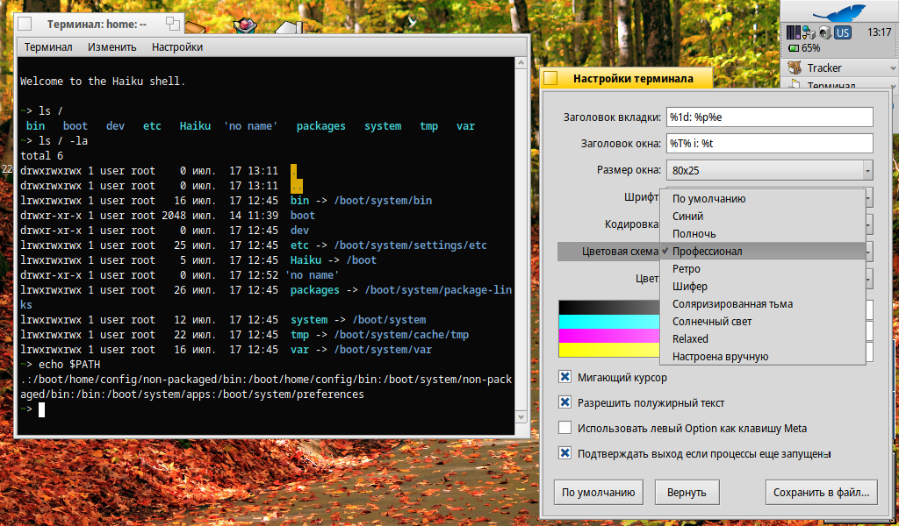
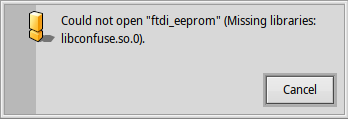

# Пару слов про Haiku. Часть 4 — Внутренности ОС

<!--
- Терминал системы, PATH и запуск ПО
- Структура файловой системы
- Монтирование устройств
- Немного про установку ПО
-->



Что ж, система установлена, в ней мы даже немного освоились. Пора приступать к изучению её внутренностей. В данной части статьи поговорим про запуск ПО, немного про установку программ в систему, а также про структуру файловой системы, которая отличается от известных нам ОС.

## Терминал

Терминал, как было написано в предыдущей статье, тут самый обычный. Есть поддержка цветовых схем, сторонних шрифтов и прочего. Ничего особенного в нём нет. Из особенностей Haiku можно отметить только наличие директории `.` в переменной окружения `PATH` (`.` указывает на текущий каталог), что позволяет нам запускать программы в том числе и из текущей рабочей директории без указания пути `./`:

```bash
~> echo $PATH
.:/boot/home/config/non-packaged/bin:/boot/home/config/bin:/boot/system/non-packaged/bin:/bin:/boot/system/apps:/boot/system/preferences
```

Что ещё порадовало — можно использовать те же самые комбинации клавиш для копирования и вставки, что и в остальной системе. В Linux Ctrl+C/Ctrl+V во всех программах кроме терминала, в нём используются свои комбинации. В Haiku же такая мелочь, но мелочь, показывающая целостность всей системы. Этого очень не хватает ОС семейства Unix.

## Структура файловой системы

Сколько раз можно говорить, что FHS, используемая в Linux и других ОС семейства Unix — устаревшее неудобное говно? Что же в Haiku? А что в Haiku я не знаю, как охарактеризовать. С одной стороны, некоторые аспекты мне не нравятся. С другой — это в чём-то лучше того же самого FHS.

В общем, корневой раздел с системой монтируется не в `/`, а в `/boot`. У нас нет никакой кучи безликих и зловонных `/bin`, `/sbin`, `/etc`, `/usr`. Пользователю доступны только каталоги `/home` и `/system`. А зачем ещё что-то? Всё гениальное — просто.

Но увы — все эти ваши зловонные `/bin`, `/dev` и прочие есть, но они скрыты. Почему? Потому что они являются ссылками на аналоги в `/system`, поэтому нет нужды их отображать пользователю (в современных Linux каталоги `/bin`, `/sbin`, `/lib` также ссылки на их аналоги в `/usr`, так зачем их показывать в файловых менеджерах?). Я так понимаю, что эти ссылки были оставлены для совместимости со старым ПО, хотя я не думаю, что среди пользователей Haiku ещё остались те, кто этим самым старым софтом ещё пользуется.

## packagefs

Кстати, по поводу софта. Здесь используются `*.hpkg`-пакеты, которые на деле являются образами `packagefs`. Эти образы монтируются при загрузке (прям как `snap` в Ubuntu, только без всякого раздутого убожества вроде `snapd` и прочих). Однако при попытке вывода списка смонтированных ФС их мы почему-то не увидим за исключением `/boot/system` и `/boot/home/config`, которые также являются образами `packagefs`:

```bash
~> df -h

Mount Type Total Free Flags Device
----------------------------------
/boot bfs 600.0 MiB 6.0 KiB QAM-P-W /dev/disk/usb/0/0/0
/boot/system packagefs 4.0 KiB 4.0 KiB QAM-P -
/boot/home/config packagefs 4.0 KiB 4.0 KiB QAM-P -
/no name fat 2.8 MiB 2.3 MiB - M-PRW /dev/disk/usb/0/0/1
```

Основная беда `*.hpkg`-пакетов в том, что у них, как у традиционных для Unix пакетов, есть такая ужасная вещь как *зависимости*. Конечно, Haiku, по причине отсутствия тучи разных дистрибутивов а-ля GNU/Linux, лишена части проблем в виде отсутствия какого-то важного пакета или сильно старой версии какой-то нужной библиотеки, но всё же это не решает некоторых проблем, присущим таким системам. В частности, если два разных пакета (пусть будет пакет `A` и пакет `B`) требуют наличия в системе одной и той же библиотеки, но разных версий, то установить эт и два разных пакета `A` и `B` в систему мы всё так же не сможем.

### Динамические библиотеки

В Haiku есть поддержка и динамической линковки ПО. Но что меня поразило больше всего, так это сообщения об ошибках, когда ПО не может запуститься из-за отсутствия каких-то библиотек или иных критических ошибок:



Можете представить себе это в Linux? Он уже более 20 лет имеет графические окружения вроде GNOME, KDE, Xfce, но всё равно так и не умеет отображать сообщения о критических ошибках в работе ПО. А вы говорите, что Linux лучше Windows. Хахаха, ничего подобного.

Дошло дело до того, что никому не известная helloSystem (дистрибутив FreeBSD с нескучными обоями, блекджеком и шлюхами) научилась отображать такие ошибки в графическом режиме (а в Linux для того, чтобы узнать, почему программа не запускается, нужно попробовать снова её запустить, но уже в терминале. Просто потрясающий UX, ничего не скажешь!).
