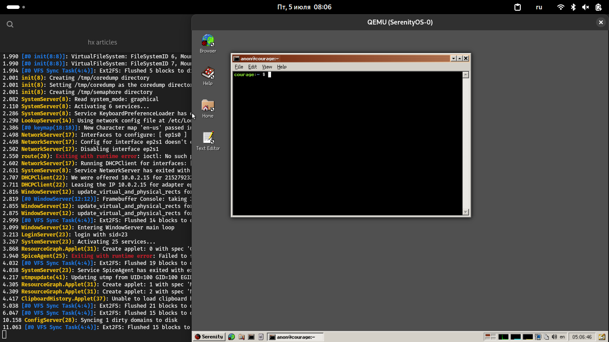
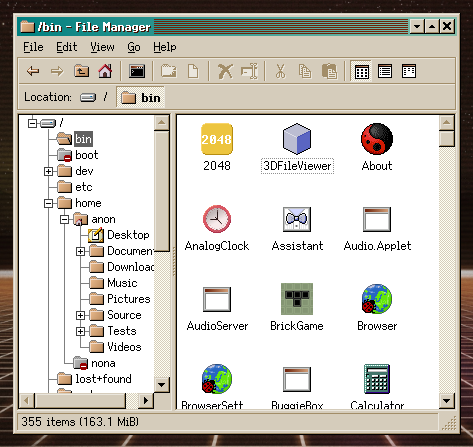

#  Пару слов про SerenityOS

SerenityOS — любительская Unix-like операционная система, разрабатываемая с 2018 года. Она предназначена для архитектуры x86, имеет своё собственное ядро и графический интерфейс «а-ля Windows 9x». Написана с нуля на языке С++. Согласно [GitHub](https://github.com/SerenityOS/serenity/graphs/contributors), за всё время работы над ней (на момент написания статьи), свой вклад в её развитие внесло больше тысячи человек.

Этой статьёй я хотел бы начать обзор всевозможных «экзотических» ОС, разрабатываемых энтузиастами. Интересно не только рассказать про саму ОС, но и про какие-то её особенности, а также примерно понять, для какой аудитории подойдёт эта система, а также примерно угадать, что ждёт её в будущем.


<small>Скриншот взят с <a href="https://serenityos.org/">сайта</a> проекта.</small>

Как запустить эту ОС, готова ли она для повседневного использования и в чём её смысл? — добро пожаловать под кат.

<!--

ЧТО ОЖИДАЕТСЯ В СТАТЬЕ:

- Сборка ОС
- запуск в QEMU
- беглый обзор графического интерфейса
- изучаем файловую систему
- пытаемся запустить хоть что-то
- мысли по поводу предназначения этой ОС, её аудитории и проч. проч. проч.

-->

## Полезные ссылки

Перед прочтением статьи можете посетить ряд сайтов для более точного понимания, что же такое эта ваша SerenityOS:

- [Сайт проекта](https://serenityos.org/);
- [GitHub репозиторий](https://github.com/SerenityOS/serenity);
- [FaQ](https://serenityos.org/faq/);

## Получение ОС

Для начинающего пользователя получить эту ОС станет не так уж просто, ведь её загрузочных образов просто нет. Придётся собирать её из исходников самостоятельно, благо процесс сборки достаточно прост. <small>Далее я буду приводить инструкции по сборке, взятые из <a href="https://github.com/SerenityOS/serenity/blob/master/Documentation/BuildInstructions.md">документации этой ОС</a>. Я пользуюсь дистрибутивом Archlinux, поэтому инструкции будут даны относительно него. В принципе, если вы используете другой дистрибутив Linux, то все различия будут заключаться только лишь в установке необходимых зависимостей для сборки ОС.</small>

Для начала склонируйте репозиторий с ОС и перейдите в директорию с исходниками:

```bash
git clone https://github.com/SerenityOS/serenity
cd serenity
```

Теперь же требуется установить необходимое ПО для компиляции системы:

```bash
sudo pacman -S --needed      \
  base-devel cmake curl      \
  mpfr libmpc gmp e2fsprogs  \
  ninja qemu-desktop         \
  qemu-system-aarch64 ccache \
  rsync unzip
```

<small>Даже не знаю, зачем тут <tt>qemu-system-aarch64</tt>, ведь SerenityOS предназначена для x86_64. Может быть, в документации этой ОС ошибка? Хотя ARM-архитектуры дас ищ гут, но мы пока остановились на x86.</small>

## Сборка ОС

Для сборки введите команду:

```bash
Meta/serenity.sh run
```

Этой командой вы начнёте сборку ОС, по завершении которой будет создан ряд файлов в директории `Build/x86_64/Root` и запущена виртуальная машина QEMU с собранной SerenityOS.

> **Обратите внимание:** хотя сама система не настолько крупная как, скажем, GNU/Linux, она всё равно будет собираться достаточно долго. На моём i3-2370M она собиралась несколько часов. Если вы знакомы с CMake, то можете попробовать изменить ряд параметров сборки, чтобы ускорить время компиляции. Но танцы с бубном вокруг CMake — не тема данной статьи, поэтому разбирайтесь в этом без меня.

 | 

## Запуск ОС

После того, как ОС будет собрана, у вас будет запрошен пароль (`sudo`) и создана виртуальная машина QEMU, в которой запустится SerenityOS. К слову, её запуск достаточно быстрый; после того, как система загрузится, сразу же откроется терминал.



Я не знаю, в чём проблема, но система очень медленная. Да, загрузилась она довольно быстро, то как же медленно там запускалось остальное ПО... Браузер стартовал-стартовал минуты 3, но так и не стартанул. Текстовый редактор загружался минут 5 и таки запустился!

А ещё здесь куча всяких разных нескучных тем оформления интерфейса (лежат в директории `/res`). Вот, например, Gruvbox Dark:


Производительность после первого запруска просто ужасная. Забегая вперёд отмечу, что после второго всё стало нормально.


Я много раз тыкал на значок «Терминал», пытаясь его запустить. И он запустился! Очень-очень много раз :-(


Да, оно ещё и «Не отвечает»...

Радует, что после повторного запуска оно всё-таки соизволило отвиснуть и начать работать побыстрее.

### Обзор интерфейса

GUI SerenityOS очень сильно напоминает интерфейс Windows 9X. Панель задач, меню «Пуск», сама тема интерфейса очень похожа на знаменитый «Redmond»... Разве что стандартная цветовая схема здесь напоминает цвета из ранних версий Ubuntu. Всё жёлто-оранжево-коричневое. Весьма неплохая идея использовать эту цветовую схему вместо уже приевшейся серо-синей, которая стала классикой не только в Windows, с интерфейса которой слизан интерфейс обзираемого проекта, но и в других ОС. Однако есть и альтернативные темы. Кастомизируй-нехочу!

Нам доступен рабочий стол с обоями и иконками, панель с главным меню (будем называть его меню «Пуск»), закреплёнными для быстрого доступа приложениями, списком открытых окон, кнопкой «Свернуть все окна», переключателем рабочих столов, областью уведомлений и часами. Всё стандартно и предсказуемо.

### Рабочий стол


Рабочий стол в стиле классических версий Windows. Панель задач, меню «Пуск», иконки на рабочем столе... Окна имеют заголовок и кнопки «Закрыть», «Свернуть» и «Развернуть». Иконки срисованы с иконок Windows эпохи середины-конца 90-х. Сравните:

 | 

### Панель задач

Панель задач вполне банальна для подобных интерфейсов. Обычный набор компонентов: меню «Пуск», закреплённые на панели приложения для быстрого доступа к ним, список открытых окон, панель уведомлений, часы и кнопка «Свернуть все окна». Исключением является разве что панель индикаторов и переключатель рабочих столов , но обычно в оконных менеджерах навроде IceWM эти компоненты присутствовали.


### Файловый менеджер

Файловый менеджер больше напоминает `explorer.exe` из Windows 98-ME:

 | 

Функционал ФМ весьма стандартный: создание, открытие, копирование, перемещение и удаление, а также просмотр свойств файлов.


Но по-настоящему удивлением для меня стало отображение миниатюр для... ELF-файлов! ELF — это формат двоичных файлов для программ и библиотек. В Linux и BSD это обычные ELF-файлы, а вот в Haiku (которая также использует ELF) и в Serenity часть программ имеет свои логотипы (как правило, это десктопный софт). И эти логотипы отображаются заместо стандартной для ELF иконки!



### Браузер

Браузер в какой-то степени является краеугольным камнем этой операционной системы. Вообще, любой мало-мальски продвинутый браузер является достаточно сложной вещью; чего уж говорить, если кодовая база Chrome больше кодовой базы операционной системы FreeBSD... В SerenityOS установлен собственный браузер, написанный специально для этой ОС и использующий свой собственный движок LibWeb.

Ну, что сказать по поводу рендеринга страниц... Пока всё ужасно. Кириллицу оно как бы понимает, но не всегда отображает корректно. А что-то сложное вроде того же самого GitHub и вовсе не может корректно отобразить. С другой стороны, разработчикам как ОС, так и браузера честь и хвала — не каждый осилит разработку таких вещей.


В этом браузере есть поддержка закладок, изменения масштаба страниц, полноэкранный режим и, что для некоторых (привет, Firefox!) может стать киллер-фичей — поддержка вертикальных вкладок:


Присутствует поддержка поисковых движков, среди которых есть даже родной Яндекс:


### Игорь.

Есть даже какие-то игры:

 | 

### Kernel Panic!

И в этой ОС тоже бывает паника ядра. Да, до хоть сколько нибудь стабильного состояния Serenity ещё далеко, но меня поразило то, что здесь сообщение о панике не просто появилось, оно даже было выведено на экран! В Linux (и, наверное, других ОС семейства UNIX), если мы работаем в графическом режиме и случилась паника, всё, что нам доступно — это мигающий индикатор Caps Lock, который показывает нам наличие паники. На этом всё. Подход явно ублюдский, но что поделаешь: GUI в UNIX традиционно недоработанный и неполноценный, в абсолютном большинстве ОС семейства UNIX он прикручен к системе синей изолентой и далеко не всегда способен полностью заменить текстовую консоль. В Serenity же графический интерфейс как-то посильнее интегрирован в ОС, а не является каким-то отдельным мало связанным с основной ОС компонентом.


## Технические детали

Теперь стоит подробнее рассказать о внутренностях этой ОС. По данным, полученным с помощью программы [tokei](https://github.com/XAMPPRocky/tokei), эта ОС состоит из более чем 1.1 млн строк на GNU Assembler и C++ (включая комментарии, возможную документацию к объектам в коде, пустые строки и, собственно, сам код). Из них около 880 тыс. строк — непосредственно сам код. Т.е. операционная система довольно компактна — у того же ядра Linux уже более 10 млн. строк кода, и это только ядро без coreutils, рабочего окружения и прочего ПО!

### Ядро

Ядро ОС расположено в файле `/boot/Kernel`, при чём содержимое каталога `/boot/` для обычного пользователя недоступно, пришлось открывать файловый менеджер от имени `root`. `/boot` по меркам современных систем вообще пустой: здесь только файлы ядра и всё. В Linux и BSD творится сущий бардак, и наряду с файлами ядра зачастую хранятся всевозможные образы initrd/initramfs, файлы загрузчика, devicetree и [иногда] куча всего ещё.

 | 

Те, кто долгое время пользуется Linux, увидят, что ядро в Serenity весит немного-немало почти 40 Мб! К примеру, в моей системе Archlinux ядро Linux-6.9.7 занимает на диске около 15 Мб. Но позвольте — у Linux'a есть огромное число модулей, расположенных в `/lib/modules`, которые на моей системе занимают около 150 Мб. Да, ядро Serenity не такое уж и маленькое, но это связано с тем, что оно монолитное, а монолитные ядра не отличаются особым минимализмом.

### Структура файловой системы

Набор системных каталогов в корне не такой уж и большой, но вполне ожидаем для такой Unixlike-ОС:


За исключением того, чего я больше всего ненавижу в Linux. А в Linux я ненавижу чрезмерное использование какой-то одной конкретной директории, когда файлы определённого типа можно раскидать по разным директориям. Ну например [в том же Linux] это каталог `/usr/bin`, в котором содержится абсолютно всё ПО, включая системное и пользовательское. О том, почему этот подход ужасен, читайте [здесь](https://linuxoid85.github.io/UNIXTime/articles/minds/linux_desktop2.html). Почти тоже самое мы видим и в SerenityOS, но тут основное ПО содержится в `/bin` (согласно свойствам — 355 файлов общим объёмом в 163,1 Мб), когда как каталог `/usr/bin` пуст. Всё, что хранится в `/usr/bin` — это программа `env`, да и та является ссылкой на `/bin/env`.


Я много раз писал о том, что хранение всех программ в одном месте — это плохо, и лучше бы разработчикам Unixlike-ОС разделить всё ПО на три типа, для каждого из которых отведено своё собственное место в файловой системе. Что-то подобное есть в ОС семейства BSD (честь и хвала им!), но нет в Linux и, похоже, нет в SerenityOS.

Кроме того, в обзираемой здесь ОС нет каталога `/sbin` (и `/usr/sbin` тоже). Этот каталог содержит программы, для выполнения которых требуются права пользователя `root`. Обычно это программы для обслуживания и администрирования ОС. Но их, по всей видимости, в SerenityOS просто нет. В принципе, эта ОС по сравнению со своими старшими братьями проста как три рубля, поэтому ей это простительно.

Содержимое каталога `/etc` весьма и весьма минималистично: конфиги специфичных для этой ОС сервисов в формате `*.ini` (вот где уж точно запахло операционками из девяностых! Такой мерзкий тухлый запашок...) и конфиги, типичные для каждой ОС семейства UNIX: `fstab`, `group`, `passwd`, `shells`, etc.

Есть каталог `/mnt`, который, согласно спецификации [FHS](https://refspecs.linuxfoundation.org/FHS_3.0/fhs-3.0.html#mntMountPointForATemporarilyMount), предназначен для временно монтируемых файловых систем, но нет каталога `/media`, предназначенного для съёмных носителей типа флешек, CD/DVD-дисков и прочего.

Предназначение каталога `/mod` мне неизвестно, к тому же его содержимое скрыто от обычных пользователей, а при просмотре от `root` я не увидел ничего — он пуст. Могу предположить, что `mod` — сокращение от «modules» и что в будущем ядро этой ОС будет поддерживать модули. Но это лишь мои предположения и я не знаю, что там должно быть и что будет далее.

Каталог `/proc` содержит информацию о процессах. Более ничего. В том же Linux этот каталог содержит больше данных, например `/proc/version` информацию о ядре, `/proc/meminfo`, `/proc/cpuinfo` и т.д.

`/tmp` смонтирован как RAMFS, что значит его автоматическое очищение после выключения компьютера. В принципе неплохо. В том же Linux для этих целей монтируют `/tmp` как `tmpfs`.

Что касается каталога `/usr/share/`, то тут не всё так однозначно. Поскольку SerenityOS графическая система, я ожидал увидеть здесь некоторое подобие `/usr/share/applications/` с `*.desktop`-файлами для формирования меню «Пуск» (да и вообще для того, чтобы GUI знал, какие приложения в системе вообще есть), `/usr/share/icons/` и `/usr/share/themes/` для формирования внешнего вида системы... Но всего этого здесь нет. Из всего, что есть: файлы для программ Maps и Welcome, а также man-страницы и файлы для автодополнения ввода в терминале.

Всё это, оказывается, содержится в каталоге `/res/`! Некое подобие `*.desktop`-файлов находится в `/res/apps` (эти файлы имеют схожую с `*.desktop`-структуру и имеют расширение `*.af`), иконки в `/res/icons` (самое ужасное в том, что иконки в омерзительном растровом формате PNG, а в современной системе хотелось бы видеть что-то векторное — тот же SVG или [HVIF](https://habr.com/ru/articles/79163/) как в Haiku OS), также в этом каталоге есть цветовые схемы, темы оформления, темы курсоров, смайлики, шрифты и прочее.

 | 

Что касается каталога `/var`, хранящего в себе часто изменяемые данные, то тут есть только `/var/run`, который должен содержать, согласно [стандарту FHS](https://refspecs.linuxfoundation.org/FHS_3.0/fhs-3.0.html#varrunRuntimeVariableData), часто изменяющиеся данные во время выполнения процесса. Никаких `/var/log`, `/var/cache`, `/var/lib` нет. Не знаю, хорошо ли это или плохо, но от директорий для кеша и логов я бы не отказался.

Ну и последний каталог, заслуживающий нашего внимания, это `/www`, который содержит, как видно из названия, `*.html`-страницы с информацией о системе и прочей шнягой. Пользы от него не так много, но для беглого ознакомления с тем, что же такое SerenityOS, будет достаточно.

### Нейминг файлов и не только

В UNIX-системах традиционно файлы и прочие объекты имеют названия, набранные в нижнем регистре. Часто используются сокращения, например `ls` -> list screen, `cd` -> change directory и т.д. В SerenityOS для традиционных для UNIX программ и прочих файлов используется этот подход, но всё остальное, специфичное для этой ОС, набрано в CamelCase:

- Имена файлов:
  - `/bin/About`
  - `/bin/AnalogClock`
  - `/bin/ChessEngine`
  - `/etc/FileIconProvider.ini`
  - `/etc/Network.ini`
  - и т.д.
- Библиотеки/заголовочные файлы:
  - `RequestClient.h`
  - `WebSocket.h`
  - `LibURL`
  - `Loader.so`
  - `libDeviceTree.so`
- Логи (выводятся в терминал, откуда запущена ОС):

```
6645.312 RequestServer(108:109): ConnectionCache: Connection to https://www/index.html failed: name server returned permanent failure
6645.320 RequestServer(108:109): Request with a null socket finished for URL https://www/index.html
6645.320 WebContent(107): ResourceLoader: Failed load of: "https://www/index.html", Error: Load failed, Duration: 154ms
6645.371 WebContent(107): VERIFICATION FAILED: navigable() at ./Userland/Libraries/LibWeb/DOM/Document.cpp:3051
6645.376 [WebContent(107:107)]: CRASH: CPU #0 Illegal instruction in userspace
```

- Исходный код:

```c
#include <Kernel/Boot/CommandLine.h>
#include <Kernel/Firmware/ACPI/Parser.h>
#include <Kernel/Firmware/ACPI/StaticParsing.h>
#include <Kernel/Memory/TypedMapping.h>
#include <Kernel/Sections.h>

UNMAP_AFTER_INIT NonnullLockRefPtr<ACPISysFSComponent> ACPISysFSComponent::create(StringView name, PhysicalAddress paddr, size_t table_size)
{
    // FIXME: Handle allocation failure gracefully
    auto table_name = KString::must_create(name);
    return adopt_lock_ref(*new (nothrow) ACPISysFSComponent(move(table_name), paddr, table_size));
}
```

### Разработка

Сама система написана на языке C++. Кроме того, она имеет свою собственную стандартную библиотеку этого ЯП. Однако здесь есть особенность: в отличие от других реализаций, в реализации С++ из SerenityOS нет поддержки исключений. В системе присутствуют необходимые библиотеки (`/usr/lib`) и заголовочные файлы (`/usr/include`) для того, чтобы начать разрабатывать под эту ОС мало-мальски полезный софт. Раз уж SerenityOS имеет достаточно симпатичный и функциональный GUI, то почему бы не начать использовать `libgui` для создания графического ПО?

В системе уже есть простенькая IDE HackStudio, HEX-редактор, программа для работы с SQL и, конечно же, терминал!


К слову, если ввести в терминале, к примеру, команду `ls /bin`, то вы увидите, что программы в выводе подчёркнуты пунктиром. Это не артефакты и не проблемы отображения шрифтов — эти файлы действительно так выделены. Наведите курсор на нужную вам программу и нажмите на неё двойным кликом — вуаля! Программа запустилась. Тоже самое и с путями в файловой системе: двойной клик по `/bin` (в введённой команде) и файловый менеджер откроет этот каталог. Не знаю, зачем это нужно, но выглядит интересно.


## Особенности ОС

Среди интересных особенностей этой ОС можно отметить то, что как таковой фиксации версий не существует. Нет такого понятия как «SerenityOS 1.0» или «SerenityOS 1.1 Alpha». Мы просто клонируем `master`-ветку из git-репозитория и собираем ОС из исходников. Кроме того, как я написал уже ранее, уже собранных образов или дистрибутивов этой ОС также не предоставляется — ожидается, что пользователь соберёт систему самостоятельно.

Несмотря на то, что ОС написана на С++, это не совсем тот С++, который мы все знаем: авторы называют этот язык «Serenity C++». В нём остутствуют исключения и имеется своя стандартная библиотека.

Для SerenityOS был разработан собственный фреймворк для создания графических интерфейсов ПО LibGUI с собственным набором виджетов. Да и вообще вся SerenityOS больше является «вещью в себе»: своё ядро, своя стандартная библиотека С++, свой GUI... Даже свой браузер есть со своим движком LibWeb, который, кстати, не так давно отпочковался от SerenityOS и стал самостоятельным проектом, способным работать в том числе в Linux.

---

## Поддержать меня

Если вам понравилась эта статья, то вы можете отправить мне донат:

> **2202 2062 5233 5406** (Сбербанк)

На данный момент мне требуется новый ноутбук, на котором я смогу продолжить писать статьи, поэтому каждый донат приблизит дату его приобретения на какой-то небольшой срок. Заранее спасибо!
