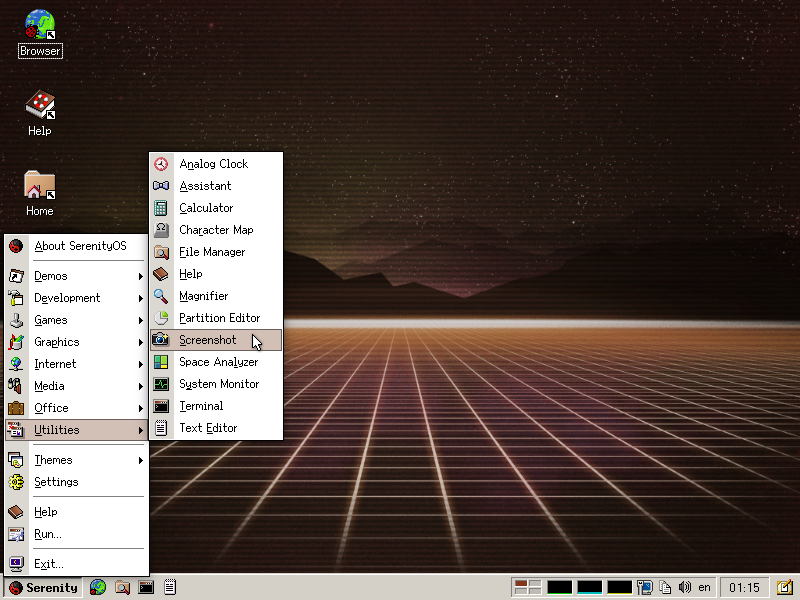

#  Галерея

В данном подразделе содержатся скриншоты операционной системы SerenityOS, сделанные автором статьи.

## Рабочий стол

Система после загрузки.

Пустой рабочий стол.

Меню «Пуск».

Программы в главном меню.

Изменение темы оформления через главное меню.

Рабочий стол с открытыми окнами и контекстным меню.

Меню окна.

Меню рабочего стола.

Меню панели задач.

## Окна

Окно «About SerenityOS».

Окно «Run».

Окно выбора файла.

Окно «О программе».

Command palette.

Системный монитор.

Настройки системы.

Карты. Открыта карта города.

Карты. Открыта карта с отображением пользователей SerenityOS. Для того, чтобы попасть на эту карту, нужно зарегистрироваться.
