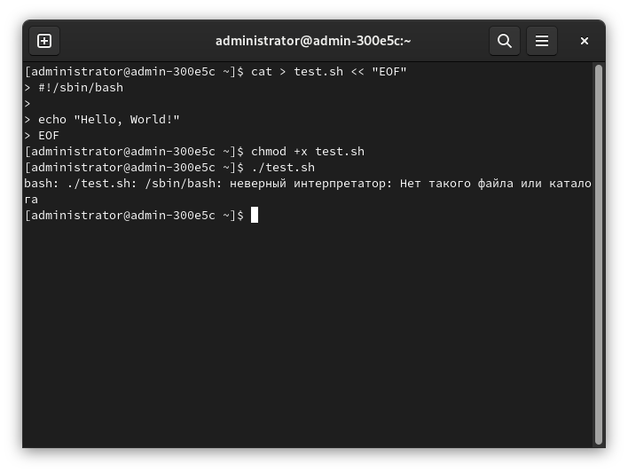
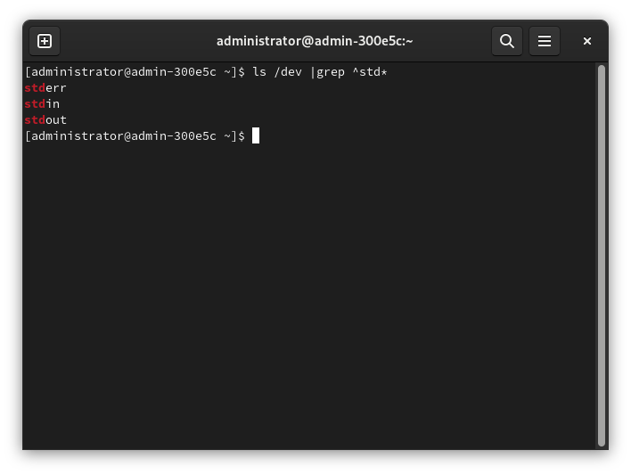
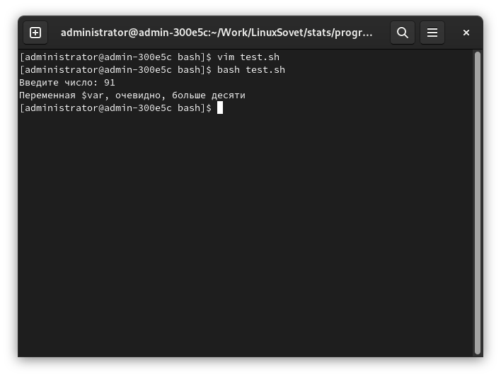

# Использование BASH для написания скриптов. Часть 1.

<pre>
<strong>Автор:</strong> Михаил Краснов
<strong>Дата написания:</strong> 06.02.2022 13:01;
                                 отреставрировано и выложено на новый сайт 15.07.2024
</pre>


Доброго времени суток! [Первая статья](jq.md) об этом интерпретаторе вышла на тему парсинга JSON, но я очень давно планировал написать материал, в кратком формате описывающий основы использования bash, поэтому вот очень небольшая часть из этих планов. Было несколько коротких записей, вскользь касающихся этой замечательной оболочки в UNIX-системах, но они не могли похвастаться полнотой и содержательностью.

Что ж, спустя два года я смог осуществить свой план - и вот вы читаете эту статью. Это только первая часть, она повествует только о части самых основных вещей (ввод/вывод, перенаправление, ветвление). Кроме того, пишется и вторая часть с более подробными сведениями. Следите за обновлениями как здесь, так и на сайте, куда я выложил первоначальную версию статьи (см. блок "Смотрите также").

Данный "справочник" предназначен для тех пользователей GNU/Linux или каких-то других UNIX-систем, которые имеют хотя бы какой-то опыт работы с ними. Запуск терминала, запуск программ оттуда, какие-то другие сведения. Иначе вам будет непонятно. Если в GNU/Linux или какой-то другой UNIX-системе вы всего-лишь два дня (как пример, не цепляйтесь), то увы - эта статья не для вас. В таком случае советую почитать что-то вроде Linux Bible и прочих подобных книг, которые дают хорошее представление об операционной системе GNU/Linux и, в частности, ядре Linux.

## Содержание

- 1 Запуск скриптов
    - 1.1. Пару слов о правах доступа
    - 1.2. Пару слов о sha-bang
    - 1.3. Особенности использования sha-bang
- 2 Потоки данных и перенаправление
    - 2.1. stdout - 1
    - 2.2. stderr - 2
    - 2.3. stdin - 0
    - 2.4. Стандартные дескрипторы файлов
- 3 Перенаправление потоков и конвейеры
    - 3.1. Операции
    - 3.2. Закрытие дескрипторов файла
    - 3.3. Конвейеры
    - 3.4. Комбинирование операций перенаправления и/или конвейеров
    - 3.5. Применение
- 4 Условные операторы. Ветвление
    - 4.1. if...elif...else
        - 4.1.1. if одиночный
        - 4.1.2. if...else
        - 4.1.3. if...elif...else
    - 4.2. Логические операции
    - 4.3. Работа со строками
    - 4.4. Работа с выражениями (числами, например)
    - 4.5. Работа с файлами
- 5 Операторы выбора
    - 5.1. case
        - 5.1.1. Создание простых одноуровневых меню
    - 5.2. select
- Смотрите также
- Дополнительные ссылки на каналы и чаты LinuxSovet
- Выводы

## 1. Запуск скриптов

Файлы с bash-скриптами содержатся в файлах с расширением `*.sh`, хотя в UNIX понятие "расширение" не используется для определения типа файла.

### 1.1. Пару слов о правах доступа

Для того, чтобы запустить какой-либо файл как программу, требуется выдать этому файлу право запуска. Если его нет, то оболочка выдаст ошибку ***отказано в доступе***.

Для изменения прав доступа к файлам используется программа `chmod`. Для того, чтобы выдать право исполнения файла требуется ввести:

```bash
chmod +x $FILE
```

Где `$FILE` - имя нужного файла.

`+` означает включение определённого права, а `x` - право исполнения (от слова `eXecutable`).

Далее по тексту не буду заострять на этом внимания, так как разбор прав доступа к файлам в UNIX - это не тема статьи, а тем, кто хочет узнать про это больше, рекомендую почитать [третью часть](/LinuxSovet/stats/LFS/LinuxStr3/LinuxStr3.html) статьи о строении GNU/Linux, где как раз написано об этом.

### 1.2. Пару слов о sha-bang

Кроме того, в первую строку файла вставляется последовательность, именуемая *шебангом*. Шебанг содержит путь до интерпретатора, с помощью которого требуется запустить скрипт. Он не нужен в следующих случаях:

* Если скрипт запускается путём передачи нужному интерпретатору пути до этого скрипта, например:
```bash
bash /usr/local/bin/myscript.sh
```
* Если этот скрипт написан для того интерпретатора, который установлен по умолчанию для пользователя, от имени которого запускается скрипт.

Например, дан такой bash-скрипт:

```bash
#!/bin/bash

echo -n "Enter your name: "
read name

echo "Hello, $name !"
```

И запускается он следующей командой:

```bash
./myscript.sh
```

Здесь `./` означает путь до файла скрипта, означающий, что он находится в текущей рабочей директории. Для того, чтобы запустить какой-либо исполняемый файл (программу или скрипт, не важно), директория, в которой он находится, должна содержаться в переменной `$PATH`. В случае, если директории, в которой содержится необходимый для запуска файл, нет в `$PATH`, то нужно либо добавить её туда (плохой способ), либо просто указать путь до файла.

### 1.3. Особенности использования sha-bang

От системы к системе вид шебангов может незначительно изменяться. Например, в большинстве UNIX-систем, в том числе и в GNU/Linux, шебанг будет выглядеть так:

```bash
#!/путь/до/интерпретатора
```

Но в некоторых системах семейства *BSD вид будет таким:

```bash
#! /путь/до/интерпретатора
```

Кроме того, следите за тем, чтобы в шебанге был указан правильный путь до интерпретатора, т.е., чтобы по указанному пути он существовал, иначе вызовется следующая ошибка:



Как видно из скриншота, шебанг имеет вид `#!/sbin/bash`, а `bash`'a там нет, так как он содержится в директории `/bin/`.

Кроме того, не стоит путать шебанги с комментариями. Различие в том, что шебанг, грубо говоря, указывает оболочке, какой интерпретатор использовать при выполнении скрипта, а так же он содержится в первой строке файла. Если он будет где-то на других строках, то он будет уже обычным *комментарием*.

## 2. Потоки данных и перенаправление

В системе по умолчанию "открыты" три файла - `stdout`, `stderr` и `stdin`. Эти, как и другие файлы, могут быть перенаправлены. "Перенаправление" означает получение вывода из файла, программы и т.п. и передача его на вход в другой файл, программу и т.п.



С каждым открытым файлом связан дескриптор файла. 0, 1, 2 - дескрипторы необходимых нам `stdin`, `stdout`, `stderr`. При открытии доп. файлов дескрипторы с 3 по 9 остаются незанятыми. Кроме того, доп. дескрипторы могут сохранять в себе ссылку на `stdout`, `stderr` или `stdin`.

### 2.1. `stdout` - 1

Стандартный поток вывода данных для программ. К примеру, команда `ls` выводит список файлов и директорий именно в этот поток.

### 2.2. `stderr` - 2

Поток вывода ошибок. Если программа (конечно же, нормальная, а не кривая) возвратила ошибку, то она пишет сообщение об этом именно сюда. Например, когда программа `killall` не находит нужный процесс для "убийства", то сообщение об этом пишет сюда.

### 2.3. `stdin` - 0

Поток ввода данных. Для терминала *стандартный ввод* - это клавиатура. Некоторые команды bash/программы принимают ввод из `stdin`, если в командной строке не указан файл или что-то прочее, откуда следует брать данные. Например, `cat`.

### 2.5. Cтандартные дескрипторы файлов

Как известно, в UNIX всё есть файл, и GNU/Linux - не исключение. Файлы, в том числе, ввод и вывод также (см. фото выше). Операционная система идентифицирует файлы с использованием дескрипторов.

Каждому процессу позволено иметь до девяти открытых дескрипторов файлов.

Рядом с именами потоков вы видели номера (0, 1, 2). Оболочка bash резервирует первые три дескриптора с этими идентификаторами:

- 0, он же `stdin` - standart input - стандартный поток ввода;
- 1, `stdout` - standart output - стандартный поток вывода;
- 2, `stderr` - standart error - стандартный поток ошибок.

## 3. Перенаправление потоков и конвейеры

У пользователя во время написания своих скриптов по каким-то причинам может возникнуть потребность в перенаправлении обычных сообщений (`stdout`) и сообщений об ошибках (`stderr`). Например, перенаправление в файл. Это может быть полезным при организации логирования (журналирования) скрипта.

Для этого используются команды перенаправления для соотв. дескрипторов с указанием файлов или команд, куда должны перенаправляться сообщения. Например:

```bash
killall sdfgsdghsdg 2> ./killall.log
```

Здесь `sdfgsdghsdg` - специально допущенная мною абракадабра путём рандомного нажатия пальцев по клавиатуре 😁️. Просто для того, чтобы спровоцировать ошибку. С помощью `2>` я перенаправил вывод `killall` сообщения об ошибке из `stderr` в файл `./killall.log`. Уберите двойку из команды и посмотрите на результат:

```bash
killall sdfgsdghsdg > ./killall.log
```

Или вот:

```bash
ls -l / > ./ls.log
```

Здесь я перенаправил вывод `ls -l /` из `stdout` в файл `./ls.log`.

Если надо перенаправить выводы в `stderr` и `stdout` куда-то, например, в один и тот же файл, можно воспользоваться `&>`.

В случае, если пользователю необходимо таким образом обеспечить логирование своего скрипта, то использование `>` или чего-то подобного будет неподходящим, так как с каждым новым перенаправленным в лог сообщением файл, куда оно перенаправляется, будет затёрт. Чтобы избежать этого, используйте `>>`. Например:

```bash
echo "some log message" >> some.log
```

### 3.1. Операции

- `>` перенаправляет `stdout` в файл, например, и усекает его до нулевой длины. В случае, если до выполнения этого оператора файла не существовало, то будет создан новый.

> **ЛАЙФХАК:**

> Для того, чтобы быстро очистить какой-либо файл, можно не стирать его содержимое вручную в текстовом редакторе, а, например, выполнить:

```bash
> file
```

> Где `file` - нужный файл.

- `>>` перенаправляет `stdout` в файл, например. Но не усекает его до нулевой длины, как предыдущий `>`, а *дописывает* информацию в конец.
- `1>` и `1>>` - аналогично `>` и `>>` соотв.
- `2>` и `2>>` - аналогично `>` и `>>` соотв., но перенаправляет `stderr`, а не `stdout`.
- `&>` перенаправляет `stdout` и `stderr`.

Это были самые используемые, но кроме них есть ещё несколько вещей:

- `2>&1` перенаправляет `stderr` на `stdout`.
- `i <& j` перенаправляется файл с дескриптором `i` в `j`.
- `[j] <> file` открытие файла `file` на чтение и запись, связывание его с дескриптором `j`. В случае, если дескриптор (в данном случае `j`) не указан, то берётся дескриптор 0 - `stdin`.

### 3.2. Закрытие дескрипторов файлов

- `f<&-` - закрыть дескриптор входного файла `f`.
- `0<&-` или `<&-` - закрыть стандартный ввод.
- `g>&-` - закрыть дескриптор выходного файла `g`.
- `1>&-` или `>&-` - закрыть стандартный вывод.

### 3.3. Конвейеры

Хочу **отдельно** отметить конвейеры (они же - каналы, они же - пайпы (`pipe`)) - `|`.

*Конвейер* - однонаправленный канал межпроцессорного взаимодействия. Конвейеры используются для связи несколько команд или программ путём перенаправления вывода одной команды (`stdout`) на вход последующей (`stdin`):

```bash
command1 | command2 | ... | commandN
```

То, что выводит на поток вывода предыдущий процесс, попадает в поток ввода следующего процесса.

К примеру:

```bash
ls ./src -l | wc -l *.py
```

Код возврата конвейера равен коду возврата последней команды, однако это поведение можно и изменить, включив `pipefail`:

```bash
set -Eeuo pipefail
```

Несмотря на то, что конвейер оперирует файловыми дескрипторами потоков ввода/вывода, все операции выполняются в памяти. Без нагрузки на ЖД.

### 3.4. Комбинирование операций перенаправления и/или конвейеров

Как ни странно, всё это можно и комбинировать.

Например, комбинирование операций перенаправления:

```bash
command1 < input_file > output_file
```

Или комбинирование конвейеров и перенаправления:

```bash
command1 | command2 | file
```

Кроме того, команда `tee` может перенаправить вывод команды или программы в несколько мест одновременно:

```bash
command | tee file
```

Где `command` - нужная команда, а `file` - файл.

Вот такие "схемотичные" примеры дают понять всю мощь UNIX-систем.

### 3.5. Применение.

Как я уже упоминал ранее, использование перенаправления и, может быть, конвейеров (пайпов) может пригодиться для создания файлов отчётов и организации журналирования пользовательских скриптов.

```bash
#!/bin/bash
# Запись событий в файл. Скрипт должен запускаться от имени root для того,
# чтобы мог записывать в /var/log

if [ $(whoami) -ne 0 ]; then
    echo "Скрипт должен быть запущен от имени root!"
    exit 67
fi

# Функция для записи сообщений в лог
# Формат сообщений: "дата сообщение"
function log_msg() {
    echo "$(date) $*" >> /var/log/example.log
}

...

# Далее найдите употребление этой функции, к примеру, пусть делает попытки обновить пакеты системы до новой версии, или что-то вроде того
```

## 4. Условные операторы. Ветвление.

Можно ли назвать скрипт *функциональным* и *продвинутым*, если он не умеет выбирать нужные действия в зависимости от каких-то параметров и указаний? Наверное, нет. К тому же, очень часто bash-скрипты используются в автоматизации каких-либо процессов у системных администраторов, разработчиков и прочих подобных персон. К счастью, в BASH есть оператор ветвления `if`.

### 4.1. `if...elif...else`.

**4.1.1. `if` одиночный.**

Самое "минимальное" утверждение `if` имеет следующий синтаксис:

```bash
if УСЛОВИЕ
then
    КОМАНДЫ
fi
```

> Обязательным является `fi` (`if` наоборот - чтобы легче запомнилось), как бы "закрывающий" конструкцию `if`. Всё-таки, ни круглых скобок как в С здесь нет, ни отступов, как в Python...

За `if` следует какое-то условие `УСЛОВИЕ`. Если оно правдиво, то выполняются команды, заключённые между `then` и `fi`. Если условие ложно, то команды между `then` и `fi` не выполняются.

Для некоторых операций (например, сравнения) требуется помещать условие в одинарные (`[ ]`) или двойные (`[[ ]]`) квадратные скобки.

Такую конструкцию ветвления можно рассмотреть на следующем примере, который просто проверяет, является ли заданное число больше десяти:

```bash
#!/bin/bash
# Скрипт для сравнения чисел

# Ключ -n отключает перенос на новую строку. Такое удобно использовать, когда
# выведенное с помощью echo сообщение является приглашением к вводу чего-либо,
# как в данном случае
echo -n "Введите число: "
read var

if [[ $var -gt 10 ]]
then
    # \ в данном случае является экранирующей последовательностью. Без неё
    # была бы просто $var, тогда бы было выведено именно значение этой
    # переменной, а мне надо - только её название.
    echo "Переменная \$var, очевидно, больше десяти"
fi
```

Кроме того, данный пример я моге сократить всего-лишь на одну строку, перенеся `then` на строку выше. Не забываю про "разделитель" `;`:

```bash
#!/bin/bash
# Скрипт для сравнения чисел

# Ключ -n отключает перенос на новую строку. Такое удобно использовать, когда
# выведенное с помощью echo сообщение является приглашением к вводу чего-либо,
# как в данном случае
echo -n "Введите число: "
read var

if [[ $var -gt 10 ]]; then
    # \ в данном случае является экранирующей последовательностью. Без неё
    # была бы просто $var, тогда бы было выведено именно значение этой
    # переменной, а мне надо - только её название.
    echo "Переменная \$var, очевидно, больше десяти"
fi
```

В следующих примерах будет использоваться именно такая запись:

```bash
if УСЛОВИЕ; then
    КОМАНДЫ
fi
```

Запустите скрипт:

```bash
bash test.sh
```



**4.1.2. `if...else`.**

Предыдущий пример не особо действенный. Что будет, если я введу число меньше десяти? Скрипт ничего полезного не выведет. Поэтому предлагаю усовершенствовать его. Теперь наш сценарий в случае, если переменная меньше или равна десяти, будет выведено соотв. сообщение:

```bash
#!/bin/bash
# Скрипт для сравнения чисел

echo -n "Введите число: "
read var

if [[ $var -gt 10 ]]; then
    echo "Переменная \$var, очевидно, больше десяти"
else
    echo "Переменная \$var меньше или равна десяти"
fi
```

**4.1.3. `if...elif...else`.**

Есть ещё и такая вещь. Условия, ясное дело, оцениваются последовательно.

Давайте усовершенствуем скрипт, чтобы он выводил ещё более точные значения:

```bash
#!/bin/bash
# Скрипт для сравнения чисел

echo -n "Введите число: "
read var

if [[ $var -gt 10 ]]; then
    echo "Переменная \$var, очевидно, больше десяти"
elif [[ $var -eq 10 ]]; then
    echo "Переменная \$var равна десяти"
else
    echo "Переменная \$var меньше десяти"
fi
```

### 4.2. Логические операции

Логические операции довольно часто используются в BASH-скриптах. Вот некоторые из них:

- `&&` - логическое И:
```bash
if [ условие1 ] && [ условие2 ]; then ... fi
# Возвращает правду (true), если условие1 и условие2 истинны.
# Можно и так:
if [[ условие 1 && условие2 ]]; then ... fi
# Заметьте, что && не должен использоваться внутри одинарных []
# Можно и так:
if [ условие1 -a условие2 ]; then ... fi
```

> **ВНИМАНИЕ!**

> У `&&` есть и ещё одно значение, о котором напишу позже.

- `||` логическое ИЛИ:
```bash
if [ условие1 ] || [ условие2 ]; then ... fi
# Возвращает правду (true), если хотя бы одно из условий истинно.
# Можно и так:
if [[ условие1 || условие2 ]]; then ... fi
# Заметьте, что && не должен использоваться внутри одинарных []
# Можно и так:
if [ условие1 -o условие2 ]; then ... fi
```

### 4.3. Работа со строками

- `==` - равно.
- `!=` - не равно.
- `-z` - пустая строка.
- `-n` - не пустая строка.

### 4.4. Работа с выражениями (числами, например)

- `-eq` - равно.
- `-ne` - не равно.
- `-lt` - меньше.
- `-le` - меньше или равно.
- `-gt` - больше.
- `-ge` - больше или равно.

Например:

```bash
if [ $(whoami) != "root" ]; then
    echo "Ошибка: вы должны запустить этот скрипт от имени root!"
    exit 1
else
    echo "Проходите!"
fi
```

### 4.5. Работа с файлами

- `-e` - проверка на существование файла или директории.
- `-f` - проверка на существование файла.
- `-d` - проверка на существование директории.
- `-h` - симлинк.
- `-s` - файл существует, он не пустой;
- `-r` - файл доступен для чтения.
- `-w` - файл доступен для записи.
- `-x` - файл доступен для выполнения.

## 5. Операторы выбора

Как и конструкции ветвления, операторы выбора предназначены для управления ходом исполнения скрипта в зависимости от начальных или конечных условий.

### 5.1. `case`

`case` позволяет выполнить тот или иной участок кода в зависимости от результатов проверки условий. Может пригодиться при создании каких-либо меню.

Синтаксис:

```bash
case "$переменная" in
    значение1)
        команды1
    ;;
    
    значние2)
        команды2
    ;;
    
    значение3)
        команды3
    ;;
    
    ...
    
    значениеN)
        командыN
    ;;
esac
```

Кроме того, в каждом блоке может быть и по нескольку значений:

```bash
case "$переменная" in
    значение1|значение2)
        команды1
    ;;
    
    значение3)
        команды2
    ;;
    
    значение4|значение5|значение6)
        команды3
    ;;
esac
```

**5.1.1. Создание простых одноуровневых меню.**

```bash
#!/bin/bash

echo "Выберите дистрибутив GNU/Linux, который вы используете:"
echo "1 - [D]ebian"
echo "2 - [F]edora"
echo "3 - [S]lackware"
echo "4 - [G]entoo"
echo "5 - [O]ther"

echo -n "> "
read distro

case "$distro" in
    # Пользователь может ввести как цифру, так и букву в верхнем или нижнем
    # регистре
    1 | "D" | "d")
        echo "Debian - прекрасный дистрибутив GNU/Linux, который подойдёт для тех, кому нравится надёжность"
    ;;
    
    2 | "F" | "f")
        echo "Fedora - для тех, кому нравятся последние, но очень надёжные и вылизанные версии GNOME Shell"
    ;;
    
    3 | "S" | "s")
        # Здесь \ является экранирующей последовательностью. Без неё нам бы
        # пришлось использовать два вида кавычек: одинарные и обычные.
        echo "Slackware - самый \"юниксовый\" дистрибутив GNU/Linux!"
    ;;
    
    4 | "G" | "g")
        echo "Gentoo - прекрасный дистрибутив GNU/Linux для тех, кто любит максимальный контроль над системой. Это source-based дистрибутив."
    ;;
    
    # * - означает все те значения, которые не были описаны выше. Аналог
    # 'default' из конструкции 'switch case' в Си и С++
    5 | "O" | "o" | *)
        echo "Увы, скрипт, который вы запустили, не знает о таком дистрибутиве :-("
    ;;
esac
```

### 5.2. `select`

`select` является ещё одним инструментом, который можно применять для создания меню.

Синтаксис:

```bash
select ЗНАЧЕНИЕ in [СПИСОК]
do
    КОМАНДЫ
done
```

Где `[СПИСОК]` - серия строк, разделённых пробелом, диапазон чисел, вывод команды, массив и пр.

```bash
#!/bin/bash

echo "Выберите дистрибутив, которым пользуетесь:"
select distro in "debian" "rhel" "lfs" "arch" "gentoo" "crux"; do
   echo "Вы используете дистрибутив: $distro"
   break
done
```

> Этот пример был взят из нашего [канала](https://t.me/linuxsovet/170) в Telegram.

Кроме того, инструменты `select` и `case` можно объединять друг с другом:

```bash
#!/bin/bash

echo "Выберите дистрибутив, которым пользуетесь:"
select distro in "debian" "fedora" "slackware" "gentoo"; do
    case "$distro" in
        "debian")
            echo "Debian - прекрасный дистрибутив GNU/Linux, который подойдёт для тех, кому нравится надёжность"
        ;;
    
        "fedora")
            echo "Fedora - для тех, кому нравятся последние, но очень надёжные и вылизанные версии GNOME Shell"
        ;;
    
        "slackware")
            # Здесь \ является экранирующей последовательностью. Без неё нам бы
            # пришлось использовать два вида кавычек: одинарные и обычные.
            echo "Slackware - самый \"юниксовый\" дистрибутив GNU/Linux!"
        ;;
    
        "gentoo")
            echo "Gentoo - прекрасный дистрибутив GNU/Linux для тех, кто любит максимальный контроль над системой. Это source-based дистрибутив."
        ;;
    
        # * - означает все те значения, которые не были описаны выше. Аналог
        # 'default' из конструкции 'switch case' в Си и С++
        *)
            echo "Увы, скрипт, который вы запустили, не знает о таком дистрибутиве :-("
        ;;
    esac
    break
done
```

Здесь `break` нужен для того, чтобы произошёл выход из скрипта после выбора пользователем какого-то значения. Уберите его и посмотрите на результат.

## Смотрите также:

- `man bash`
- `help if`
- `help case`
- `help select`

## Дополнительные ссылки на каналы и чаты UNIX Time

- Наш канал в Telegram: [t.me/unixtime_channel](https://t.me/unixtime_channel)
- Наш чат в Telegram: [t.me/unixtime_chat](https://t.me/unixtime_chat)

## Выводы

В данной статье рассмотрел несколько основных конструкций BASH. Это только первая часть, скоро выйдет вторая, в которой будут рассмотрены циклы, более продвинутая работа с переменными, обработка текста, escape-последовательности и прочее. Не пропустите 😉️.

Удачи!

---

## Подержать меня

Эту статью я написал несколько лет назад, но вскоре она оказалась утеряна. Чтобы я больше ничего не терял, вы можете отправить мне донат на карту:

> 2202206252335406 (Сбербанк)

На данный момент мне нужен новый ноутбук, поэтому вы можете ускорить его приобретение, отправив мне донат. Спасибо!