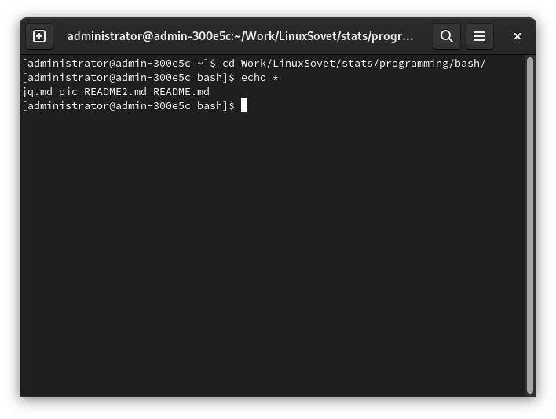
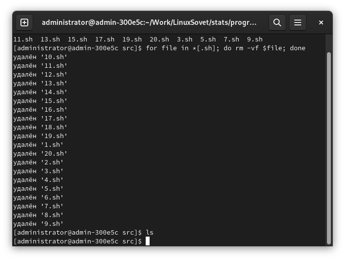
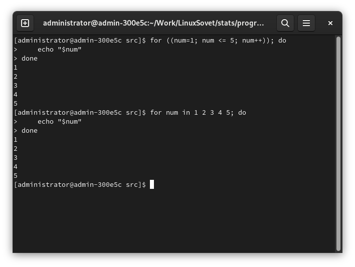
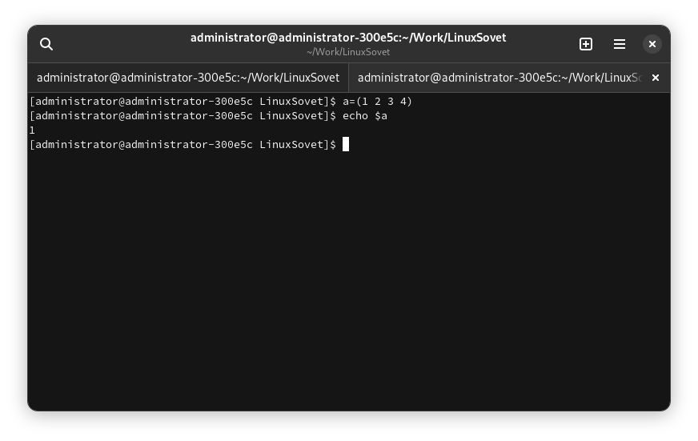
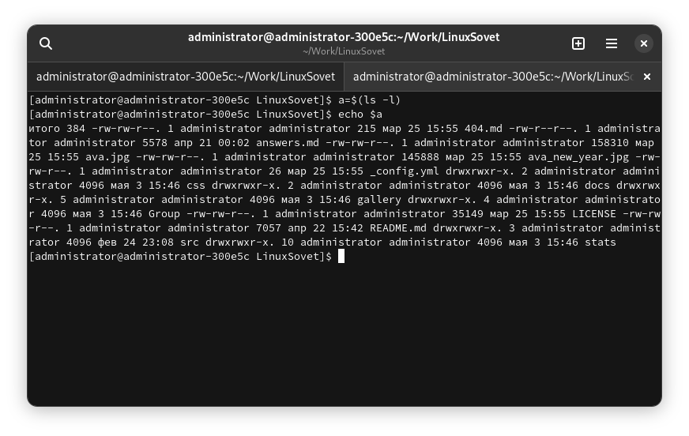

# Использование BASH для написания скриптов. Часть 2.


Доброго времени суток! В [первой части](bash1.md) рассмотрел несколько базовых
конструкций BASH, а именно: ввод/вывод информации, перенаправление и
конструкции ветвления и выбора. Сейчас же будет рассмотрено ещё несколько
конструкций, часто используемых не только в BASH, но и в других командных
оболочках.

## Содержание

- 1 Циклы
    - 1.1. for
        - 1.1.1. Цикл for с двумя параметрами в каждом из эл-тов списка
        - 1.1.2. Обработка файлов в цикле for
        - 1.1.3. Подстановка команд
        - 1.1.4. Си-подобный синтаксис
        - 1.1.5. Бесконечные циклы
        - 1.1.6. Преждевременный выход из цикла
    - 1.2. Цикл while
        - 1.2.1. Си-подобный синтаксис
    - 1.3. Цикл until
- 2 Функции
    - 2.1. Аргументы функций
    - 2.2. Специальные переменные
    - 2.3. Коды возврата функций
- 3 Особенности применения скобок

## 1. Циклы

*Цикл* - блок команд, выполняющийся многократно, пока истинно определённое
условие, либо пока не будет выполнено условие выхода из цикла.

В BASH есть три типа цикла: `for`, `while` и `until`.

### 1.1. `for`

`for` - одна из самых распространённых разновидностей циклов. Синтаксис:

```bash
for ЗНАЧЕНИЕ in [СПИСОК ЗНАЧЕНИЙ]; do
    КОМАНДЫ
done
```

Например:

```bash
# Внутри цикла (в теле цикла) выполняется и конструкция ветвления. Смотрите
# предыдущую часть статьи для получения дополнительных сведений о конструкциях
# ветвления.
for arg in "Debian" "RHEL" "Slackware" "Gentoo" "Ubuntu"; do
    if [ "$arg" -eq "Ubuntu" ]; then
        echo "$arg - вредоносный дистрибутив. Не используйте его."
    else
        echo "$arg - хороший дистрибутив
    fi
done
```

**1.1.1. Цикл `for` с двумя параметрами в каждом из эл-тов списка.**

```bash
for distro in "Debian 93" "Slackware 93" "Gentoo 02" "Ubuntu 04"; do
    set -- $distro  # Разбиение $distro на множество позиционных параметров
                    # Разбита на $1 и $2

    echo "Дистрибутив $1 был создан в $2 году"
done
```

**1.1.2. Обработка файлов в цикле `for`.**

Вывод информации о каждом файле:

```bash
# * - список всех файлов в $PWD (или $(pwd), как считаете нужным).
# 'do' перенесён на новую строку для читабельности
for file in *
do
    file $file
done
```



Удаление файлов по определённому шаблону:

```bash
# Удаление файлов, заканчивающихся на '.sh': конструкция *[.sh]
for file in *[.sh]; do
    rm -vf $file
done

# Удаление файлов, начинающихся на 'READ': конструкция [READ]*
for file in [READ]*; do
    rm -vf $file
done

# Сделайте и другие примеры с использованием подобной конструкции
```



**1.1.3. Подстановка команд.**

Кроме того, можно подставлять значения списка в цикл `for`:

```bash
DISTROS="debian ubuntu rhel slackware gentoo arch crux"

for distro in `echo $DISTROS`; do
    echo "$distro"
done
```

**1.1.4. Си-подобный синтаксис.**

```bash
# Синтаксис bash
for num in 1 2 3 4 5; do
    echo "$num"
done

# Си-подобный синтаксис
for ((num=1; num <= 5; num++)); do
    echo "$num"
done
```



**1.1.5. Бесконечные циклы.**

С помощью вышеописанного си-подобного синтаксиса можно создать и бесконечные
циклы:

```bash
for ((;;)); do
    # Ключ '-e' означает включение escape-последовательнсотей
    echo -e "Windows - must die, GNU/Linux - forever\n\tЦитата из песни MS-DOS :-)"
done
```

**1.1.6. Преждевременный выход из цикла.**

При необходимости, можно реализовать преждевременный выход из цикла.
Используйте это с осторожностью.

```bash
for var in 1 2 3 4 5 6 7 8 9 10; do
    echo "$var"
    if [[ $i -gt 7 ]]; then
        break
    fi
done
```

### 1.2. `while`

В таком цикле можно задать команду проверки некоего условия и выполнять
определённые действия до тех пор, пока условие истинно (возвращает 0[^1]).
Синтаксис:

```bash
while УСЛОВИЕ; do
    КОМАНДЫ
done
```

Например:

```bash
#!/bin/bash

var=0
lim=10

while [ $var -lt $lim ]; do
    echo "$var"
    var=$((var+1))
done
```

**1.2.1. Си-подобный синтаксис.**

```bash
#!/bin/bash

lim=10
((var = 1))

while ((var <= lim)); do
    echo "$var"
    var=$((var+1))
done
```

> **Обратите внимание!**

> Некоторые конструкции в какой-то степени похожи в нескольких разных видах
> циклов, существующих в BASH, поэтому часть из них я пропущу. Но никто не
> мешает вам экспериментировать!

### 1.3. `until`

Цикл `until` можно рассматривать как *цикл наоборот*. Он похож на `while`, но с
одной оговоркой - если `while` выполняет команды, пока условие *истинно*, то
`until` выполняет команды, пока условие *ложно*. Вот поэтому и *наоборот*.

Синтаксис:

```bash
until УСЛОВИЕ; do
    КОМАНДЫ
done
```

Как пример можно разобрать следующий скрипт, увеличивающий значение переменной
на единицу:

```bash
#!/bin/bash

c=0

until [ $c -gt 5 ]; do
    echo "variable: $c"
    ((c++))
done
```

## 2. Функции

В скрипте могут быть определены **функции** - конструкции кода, которые в
будещем будут повторяться какое-либо число раз. Синтаксис следующий:

```bash
function ИМЯ_ФУНКЦИИ() {
    КОМАНДЫ
}
```

Или короче:

```bash
ИМЯ_ФУНКЦИИ() {
    КОМАНДЫ
}
```

> **Смотрите также:**

> Работу функций я очень и очень косвенно затронул в [первой части](README.md)
> этой статьи.

### 2.1. Аргументы функций

Если функции нужно передать какой-либо параметр, то используются переменные
`$1`-`$9` и `${10}` - ...

```bash
summa() {
    echo $(($1+$2))
}

summa 1 2
```

Здесь мы объявили функцию `summa()`, которая оперирует двумя переданными ей
параметрами `$1` и `$2`.

### 2.2. Специальные переменные

Кроме тех переменных, которые я упомянул в п. 2.1 (`$1`, `$2`, etc.), существуют
ещй несколько переменных, которые довольно активно используются в bash-скриптах:

- `$0` - имя выполняемого скрипта;
- `$#` - кол-во позиционных параметров, переданных скрипту
- `$_` - поледний аргумент предыдущей выполненной команды
- `$?` - код завершения последней команды (см. далее п. 2.3)
- `$$` - PID текущего процесса
- `$!` - PID последнего асинхронного процесса
- `$*` - все позиционные параметры, собранные в одну строку
- `$@` - все позиционные параметры, подлежащие разбору.

Под *позиционным параметром* здесь подразумевается строка(и), переданная скрипту
в качестве параметра при запуске.

### 2.3. Коды возврата функций

| Код завершения | Смысл | Примечание |
|----------------|-------|------------|
| 0 | Всё успешно, ошибок нет | Программа/функция отработала нормально |
| 1 | Разнообразные ошибки | Отсутствие необходимого файла, деление на 0, etc. |
| 2 | Неверное использование встроенных команд | Используется довольно редко, обычно код завершения = 1 |
| 126 | Вызываемая команда/программа не может быть выполнена | Обычно связано с неправильными правами доступа |
| 127 | Команда не найдена | Неправильно введено название команды/программы, программа находится по пути, отсутствующим в `$PATH` |
| 128 | Неверный аргумент команды `exit` | Эта программа принимает только целочисленные значения 0 - 255 |
| 128 + x | Ошибка по сигналу `x` | Например, `kill -9 $PPID` - вернёт 137 (128 + 9) |
| 130 | Завершение программы по Ctrl + C | ^C - выход по сигналу 2, так как 130 = 128 + 2 |
| `255*` | Код завершения вне допустимого диапазона | `exit` и пр. могут принимать только целочисл значения, см. выше |

Эти коды используются в двух командах:

1. `exit` - предназначена для прерывания работы скрипта и завершения его работы;
2. `return` - предназначена для позвращения определённого значения (см. таблицу выше)
   из функции.

## 3. Особенности использования скобок

Как и во многих языках, в BASH используются скобки:

- круглые `( )`;
- круглые двойные `(( ))`;
- фигурные `{ }`;
- квадратные двойные `[[ ]]`.

Хочу заострить внимание внимательных читателей: в BASH используется конструкция
и с одинарными квадратными скобками (`[ ]`), но на самом деле это не конструкция
языка BASH (а я пишу здесь в основном о встроенных в BASH вещах, а не сторонних
программах и инструментах), а отдельная программа, которая содержится в
`/usr/bin/[`. Про левую скобку всё, но тут возникнет вопрос о том, я а что же
такое правая скобка (`]`). Правая скобка - это самый обычный *аргумент* для этой
программы `[`, который предотвращает использования других аргументов, тем самым
"закрывая" левую скобку.

### 3.1. Круглые скобки

**3.1.1. Группировка команд.**

Круглые скобки осуществляют группировку команд, например, при использовании в
конвейерах (пайпах). В таком случае команды, указанные внутри этих скобок,
являются отдельными подпроцессами:

```bash
command | (
    command1
    command2
    ...
    commandX
) | commandNX
```

В том случае, если команды, заключённые в круглые скобки, находятся на одной
строке, то они отделяются друг от друга символом точки с запятой: `;`:

```bash
command | (command1; command2; ... ; commandX) | commandNX
```

> **Смотрите также:**

> Использование пайпов (конвейеров) в BASH: [первая часть статьи](README.md).

**3.1.2. Массивы.**

Кроме того, круглые скобки можно использовать и при инициализации массива:

```bash
a=(1 2 3 4)
```



**3.1.3. Подстановка команд.**

В сочетании с `$` эта конструкция используется и для подстановки команд:

```bash
echo $(ls -l)
```

Или:

```bash
a=$(ls -l)
echo $a
```



*Немного криво получилось, но как пример сойдёт. Здесь видно, как с помощью этой
конструкции мы "записали" в переменную `a` информацию, которую команда `ls -l`
"пишет" в stdout.*

### 3.2. Круглые двойные

Двойные круглые скобки используюься для арифметических операций:

```bash
a=$((2 + 2))
echo $a
```

Кроме того, здесь есть поддержка шестнадцатеричных операций:

```bash
a=$((16#5f))
echo $a
```

### 3.3. Одиночные квадратные скобки

**3.3.1. `test`.**

`[` эквивалентно `test`. Используется при выполнении операций сравнения,
доступны `==` и `!=`. Кроме того используются `-eq` и `-gt`.

> **Смотрите также:**

> Про сравнение было написано в пункте "4. Условные операторы. Ветвление" первой
> части этой статьи.

Логическое И и логическое ИЛИ представлены как `-a` и `-o`.

**3.3.2. Регулярные выражения. Диапазоны символов.**

Квадратные скобки (одиночные) используются как часть регулярного выражения для
описания диапазона совпадающих сивполов.

**3.3.3. Массивы.**

Выше мы использовали круглые одиночные скобки для создания массива, а одиночные
квадратные скобки используются для обозначения индекса определённого элемента
этого массива:

```bash
a=$(1 2 3 4)
echo ${a[1]}
```

Хочу обратить ваше внимание на то, что элементы в массиве считаются не с
единицы, а с нуля. В принципе, всё как в любом другом языке.

[^1]: В BASH, в отличие от других языков, 0 — истина, а 1 — ложь. Так уж получилось, что программы в случае успешного завершения возвращали 0, а в случае ошибки — отличный от нуля код, поэтому логические операции в BASH именно такие.

---

## Подержать меня

Эту статью я написал несколько лет назад, но вскоре она оказалась утеряна. Чтобы я больше ничего не терял, вы можете отправить мне донат на карту:

> 2202206252335406 (Сбербанк)

На данный момент мне нужен новый ноутбук, поэтому вы можете ускорить его приобретение, отправив мне донат. Спасибо!