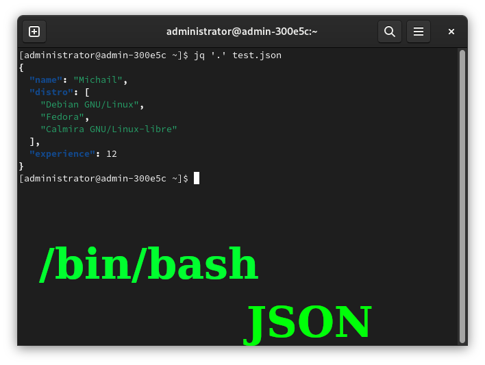
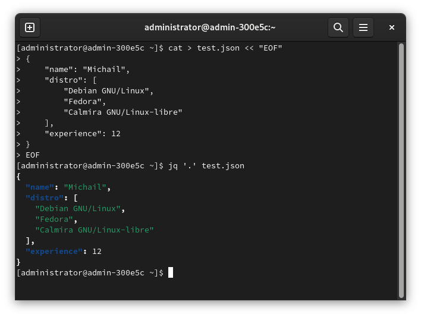
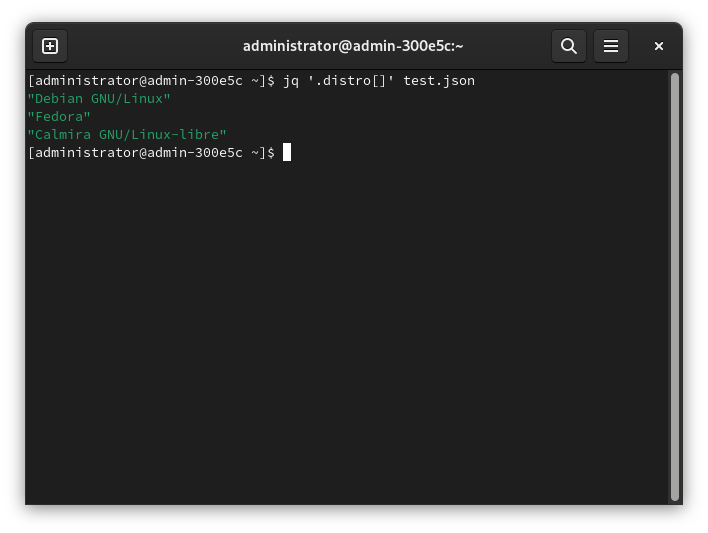
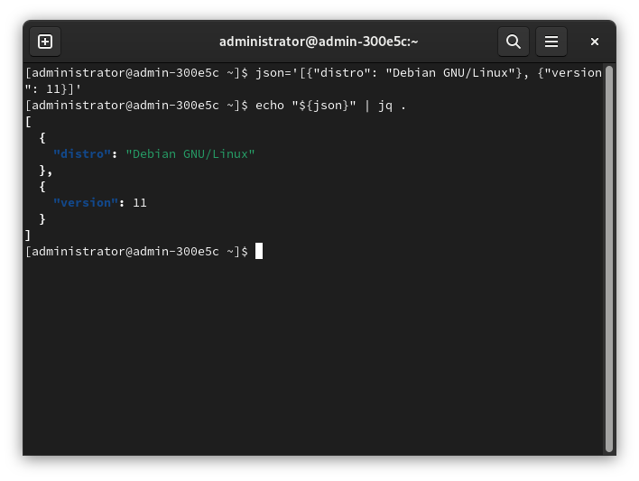
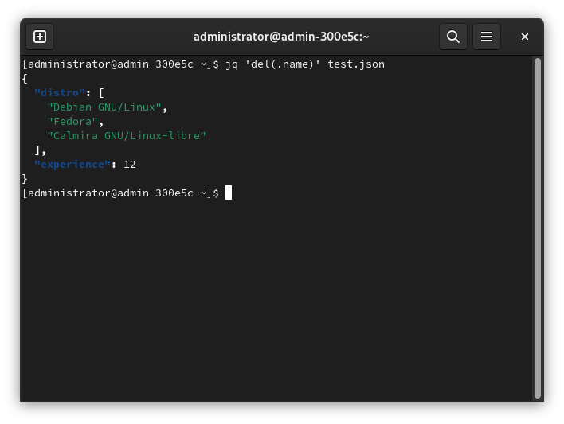

# Парсинг JSON в BASH



Всем доброго времени суток! Некоторое время назад писал статью о парсинге JSON в Python, но такое же (или почти такое же) доступно и в Bash.. Встроенных средств для этого нет, но есть пакет `jq`, предназначенный для работы с JSON-файлами.

JSON используются для различных целей, но данные из JSON не могут быть с лёгкостью прочитаны с помощью BASH, как, например, другие файлы. Поэтому для парсинга и выполнения некоторых других сведений используется именно `jq`. Это, повторюсь, не встроенное средство, поэтому установите его самостоятельно.

## Получение данных из JSON

### 1. Из файла

Предположим, у нас есть следующий файл с именем `test.json`:

```json
{
    "name": "Michail",
    "distro": [
        "Debian GNU/Linux",
        "Fedora",
        "Calmira GNU/Linux-libre"
    ],
    "experience": 12
}
```

Команда для чтения:

```bash
jq '.' test.json
```

Доступна даже подсветка синтаксиса:



Для получения эл-тов из `distro`, например:

```bash
jq '.distro[]' test.json
```



### 2. Из переменной

Пусть у нас есть следующий JSON:

```json
[
    {
        "distro": "Debian GNU/Linux"
    },
    {
        "version": 11
    }
]
```

Запишем это в переменную `json`:

```bash
json='[{"distro": "Debian GNU/Linux"}, {"version": 11}]'
```

И читаем из его данные, это предсказуемо:

```bash
echo "${json}" | jq .
```



## Удаление данных из JSON

Грубо говоря, это не совсем удаление. Следующая команда выведет все значения из JSON-файла, кроме указанных. Для этого предназначена функция `del`.

Синтаксис:

```bash
jq 'del(.что_нужно_удалить)' файл.json
```

Предположим, у нас есть `name` в файле. Для его удаления команда будет такой:

```bash
jq 'del(.name)' test.json
```



## Смотрите также:

- `man jq`
- [https://www.baeldung.com/linux/jq-comm...](https://www.baeldung.com/linux/jq-command-json)

Удачи!

---

## Подержать меня

Эту статью я написал несколько лет назад, но вскоре она оказалась утеряна. Чтобы я больше ничего не терял, вы можете отправить мне донат на карту:

> 2202206252335406 (Сбербанк)

На данный момент мне нужен новый ноутбук, поэтому вы можете ускорить его приобретение, отправив мне донат. Спасибо!